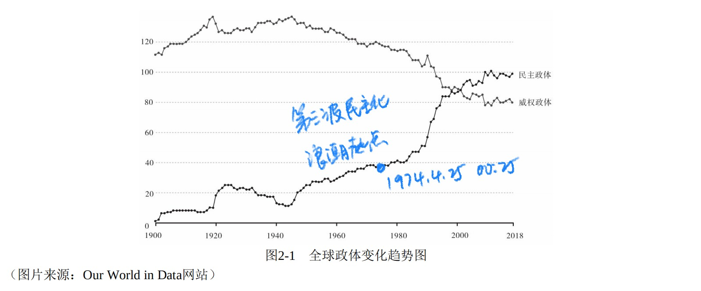
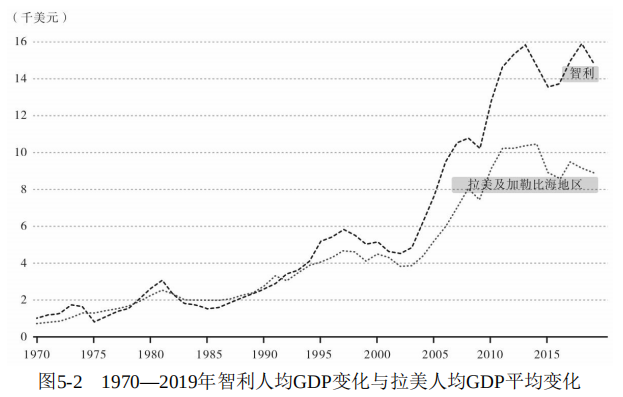

# 可能性的艺术

?> 超链接为维基百科

## 序言

- 可能性的艺术：通过比较理解政治
    > 很多时候，观点的不同来自视野的不同——海拔100米处看到的绿色田野，在海拔1000米处，可能不过是荒漠里的一小片绿洲，而到了海拔5000米处，这片荒漠又不过是漫漫大海中的一个孤岛。“比较”是为了抽离，而抽离是为了在另一个高度反观。

- 什么是比较政治学？
    > 那么，什么是“比较政治学”？也许一百个比较政治学者有一百个回答，在这里我分享一下我自己的看法。我的理解是，比较政治学当中的“比较”，与其说是一种具体的研究方法，不如说是一种研究的视野。当你把你所面对的政治现实当作一万种可能性之一来对待时，你就获得了一种“比较的视野”。带着这种广阔的视野，即使你的研究对象只是一个时代的一个国家，你的问题意识却是来源于潜在的比较。比如，当一个人追问：“为什么国家A的经济发展没有带来民主转型？”这个问题背后，实际上已经预设了一个通过比较才能获得的观点——这个观点就是：在许多其他的国家，经济发展带来了民主转型。再举一个例子，如果有人追问：“为什么在国家B民主转型带来了战乱？”同样，这个问题背后也预设了一个只有通过比较才能获得的看法，那就是“另一些国家的民主转型是和平、没有战乱的”。 
    > 
    > 所以，即使是所谓国别研究专家，也往往需要通过“比较的视野”获得重要的、有趣的研究问题，然后再将这个问题带入到对具体国家的研究当中去。他得有那个“见山不是山”的阶段，才能使“见山又是山”成为一个境界。学者李普赛特（Seymour Martin Lipset）曾说过一句话，我印象非常深刻，他说：“只懂一个国家的人不懂任何国家。”我想他表达的正是类似的意思。

    > 举个简单的例子，我记得小时候看电影电视的时候，经常看到这样的标语：“坦白从宽，抗拒从严。”当然，我们现在不这样提了，但是以前法治观念不强的时候，这种说法很常见。当时，这句话如此大义凛然，看上去简直是天经地义——一个人做了坏事当然要“坦白”，这有什么讨价还价的吗？可是，直到有一天，我看外国电影，听到了“你有保持沉默的权利，但是你所说的每句话都将成为呈堂证供……”这句话，我才意识到“坦白从宽”并非天经地义。

    > 所以我经常和学生讲，什么是社会科学的洞察力？它首先是把熟悉的事物陌生化的能力，把句号变成问号的能力，把“此时此刻”和无数“他时他刻”联系起来的能力。这种能力和每个人的敏感性有关，但是，也和每个人的“见识”有关——也就是说，你阅读过的、听过的、走过的、观察过的、思考过的越多，你就越容易把现实当作“一万种可能性之一”来对待。如果你是一个井底之蛙，那么你就永远无法获得那个反观自身的视角，甚至还可能因为这种狭隘而狂妄自大。

    > 比较政治学的功能，就是帮助我们建立一个政治可能性的参照系，以此分析理解各国政治所处的位置。

- 政治的力量
    > 直到1999年，委内瑞拉仍然是拉丁美洲人均GDP最高的国家。短短20年，一个拉美最富的国家，变成了最大的噩梦，这中间又发生了什么？民众是同样的民众，传统是同样的传统，宗教是同样的宗教，地缘位置当然也是同样的地缘位置。作为一个政治学者，我认为最大的变化就是激进左翼总统查韦斯上台了——一个自认为是罗宾侠式的政治家，以一己之力改变了委内瑞拉的政治生态，影响了委内瑞拉的经济。

- 政治的限度
    > 社会科学的思考就像是开车，需要时刻警觉，时刻观察路况，并根据路况随时调整速度和方向。一刹那间的走神，就可能导致车毁人亡。这听上去的确很累，但也是唯一安全的做法。世界是复杂的，但又不是随机的，知识也应当如此。求知的道路，意味着永恒的疲倦以及偶尔的惊喜。

---

## 第一章 全球视野

### 1.政治比较的维度

> 衡量政治发展，应该是两个尺度，一个是衡量民主问责，一个是衡量国家能力，二者缺一不可。如果用一个比喻，或许可以说，国家能力是一个政治体系的发动机，而民主问责则是一个政治体系的方向盘。没有良好的发动机，一辆车根本跑不起来，方向再正确也没有用，它只能在原地打转，但是光有很厉害的发动机，一路狂奔，越跑越快，根本不听民众指路，最后也很有可能开到悬崖底下去。

> 正是因为不同国家的政治发展处于不同象限，所以我们用“模式”来描述政治差异，而不是像形容经济发展一样，用“发达”“欠发达”来描述，因为“发达”“欠发达”这样的语言实际上是预设了一个线性的发展逻辑，但是政治发展不是线性的，它朝着不同方向开放。

### 2.和平的“爆发”：一个黄金时代？

> 再来看另外一个指标，战争死亡人数。这方面，学者平克（Steven Pinker）做出了最有影响力的研究。事实上，他专门写了一本书来告诉我们“世界正在变得更好”。这本书可能很多人都读过，叫《人性中的善良天使》——这可能也是21世纪最重要的书之一。大家可能听说过一个词，叫作“政治性抑郁”，这本书可以说专治各种“政治性抑郁”。反正每次翻这本书，我整个人就都变好了，连血糖、血脂都刷刷下降了。

> 哪怕阿富汗这样的国家，如果我告诉你它其实也在变得更加和平，你可能不相信。但是，我告诉你一些数据，你或许会改变看法。2001年美军入侵后，据估算，2001—2019年，阿富汗的战乱死亡人数大约是15.7万人，这当然非常可怕，但是1978—2001年，也就是苏军占领、内战和塔利班统治期间，阿富汗的战乱死亡人数是150万～200万人。你可能会说，啊，阿富汗已经这么惨了，居然以前更惨？是的，阿富汗人民以前真的更惨。我们之所以没有意识到这一点，很大程度上是因为**人类天生更关注现实而不是历史，而且我们习惯于用理想而不是过去来衡量当下**。

> 但是我想补充一个有趣的数据。我们都知道，北欧人是以身材高大而闻名的，但是很多人不知道的是，1830年，荷兰男性的平均身高是1米64。1米64的北欧男子啊，同学们。所以，拿破仑真的不算很矮，他只是代表了他的时代而已。

> 我知道一些人非常推崇“古典时代”，有的人向往春秋战国时代的“百家争鸣”，有的人则“梦回唐朝”，有的干脆是“民国粉”，这些怀念当然都有其道理，但是如果让我回去，我是绝对不会去的。因为我不想回到一个人均寿命30岁的时代，一个极端贫困率90%的时代，一个得了天花只能默默等死的时代，一个女性没有受教育权、就业权和婚姻自主权的时代。别说我不想回去做一个普通女性，你就是让我回去当皇帝我也不去。我在故宫也观察过所谓的龙椅，看起来真的是硬邦邦、冷冰冰，说真的，肯定没有宜家2000元一个的沙发舒服。知识分子们想象过去的时候，似乎假定自己穿越时空回到过去，还会是衣食无忧的知识分子。其实，考虑到当时的社会结构，一个随机空降的人，更有可能成为农民、铁匠、马夫，换句话说，你“梦回唐朝”的话，不大可能成为“一将功成万骨枯”里的“一将”，更可能成为其中的“万骨”而已。

> 简单来说，如果这个时代是一团漆黑，那我们需要的是什么？是革命，是极左或极右。在一个无可救药的世界里，激进是美德，越激进越推动社会进步。但是，如果我们承认时代的巨大进步，并在这个前提下谈论战争、贫穷、饥饿，那么我们需要的是什么？是改良，是耐心，是在现有国际体系、现有全球化基础上的修补。换一个说法，如果问题是主流，那么我们应该关注的重点就是“人类做错了什么”，但是如果进步是主流，那我们更应该关心的是“人类做对了什么”，从中找到进一步解决问题的钥匙。

> 衡量现实不能仅仅以理想为尺度，而且要以历史为尺度，因为摧毁进步的不仅仅可能是所谓的保守势力，而且也可能是对完美乌托邦的迷恋。用英语中的一个常用句来说就是：不要让最好成为更好的敌人。

### 3.天下与我：国际格局的多米诺骨牌效应

> “二战”以来国际体系的主要特征，可以说，就是自由霸权逐渐崛起。什么叫“自由霸权”？大家可以看到，这里面有两个词，一个是“自由”，一个是“霸权”。顾名思义，所谓“自由霸权”，就是“信奉自由主义的国家成为国际社会的霸权国家”。

> 我们常常认为，为什么会有民主？因为人们渴望民主。为什么会有市场？因为人们渴望交易。为什么会有和平？因为人们渴望和平。但是，卡根却说，不，光有渴望是不够的，历史上的人们和我们一样渴望权利、渴望交易、渴望和平，但是没有实力为这种渴望保驾护航，它就很难生根发芽。事实上，人们可能根本没有那么渴望自由、民主、和平，很多时候，人们更渴望的，可能是安全，是秩序，是大国崛起的民族自豪感。得有一个非常强势的力量在引导甚至强加，人们的价值排序才可能发生变化。

### 4.全世界有产者联合起来？全球化的经济后果

#### 全球化何以成为问题？

> 这个看法的逻辑是这样的：经济全球化虽然给跨国公司带来了巨额利润，给中国、印度这样的新兴市场带来了大发展，却牺牲了西方国家的蓝领工人，尤其是制造业工人。为什么？因为很多工作都跑到发展中国家去了，就算是留在发达国家的工作，工资也被压低了。这些被经济全球化抛弃的人一气之下动员起来，把右翼政治家选上了台。
> 
> 先搁置这个观点的是非对错不说，这个观点的出现本身就让我非常感慨。为什么呢？因为它的核心论断是：西方发达国家，至少西方国家的底层，是全球化的受害者。我记得上大学的时候，也就是20世纪90年代中期左右，我学的教科书是控诉全球化如何戕害了发展中国家。当时流行一个理论，叫作“世界体系理论”。根据这个理论，世界被分割成所谓的“中心地带”和“边缘地带”，“中心地带”由于贪得无厌，不断从“边缘地带”榨取资源，将其陷入永久的贫困。因此，所谓国际贸易、国际投资、国际金融，本质上是新殖民主义的表现形式，发展中国家几乎不可能通过全球化实现翻身。

> 大家在中学都学过“连通器原理”，就是相互连接的容器，如果我们把阻隔液体流动的关卡给撤掉，容器不同部位的水平面最后会趋于一致。全球化是什么？某种意义上，全球化就是构建一个“连通器”，它把世界各地之间的关卡都给撤掉了——撤掉之后，高处的水就哗哗流下来了，而低处的水则蹭蹭涨上去了。这一跌一涨，就出现了政治问题。哪怕各国生产率都提高，总体水位会上升，但是由于身处“连通器”的不同位置，也就是说初始位置不同，水位上升的幅度是大大不同的。

> 有学者将后冷战时代的全球化称为“超级全球化”，以区别于历史上的全球化。

#### 全球化的赢家和输家

> 除了就业，还有就是抑制工资的压力。对于美国的工人来说，本来他们在跟资本家谈判：“我们的工资很多年没涨了，今年的小时工资是不是该涨1美元了？”资本家还在那里头疼怎么回复呢，大洋对岸的中国民工举手了：“我能减10美元干同样的工作。”你说，资本家还会给这些美国工人加工资吗？
> 
> 所以，在美国蓝领工人眼里，他们花了一两百年斗争换来的工人权益——最低工资、最高工时、休假补助、医疗保障、集体谈判权……这些东西在全球化形成的连通器面前，突然变得没有意义了。全球化一个浪头就把他们打回了“丛林世界”。有研究显示，过去40年左右，美国蓝领阶层的真实工资水平，也就是扣除了通货膨胀之后的工资水平，没有变化。

> 不管怎么说，全球化的确把饼做大了，但是抢到这块饼的却不是所有人。于是，观念也随之分化。资本家阶层当然有理由热爱全球化，因为之前他们是在一个国家挣钱，现在是在100多个国家挣钱，本来微软可以卖给3亿人，现在可以卖给70亿人，本来麦当劳是开在一个国家，现在开在100多个国家，所以资本家肯定欢迎全球化。但是，工人阶层可能正好相反，他们本来可能是和100万人、1000万人竞争工作，现在却变成了和1亿人、10亿人竞争工作。

> 所以有人说，现在世界的主要矛盾，不再是发达国家和发展中国家之间的矛盾，而是各国的全球主义者站在一起，与四面八方的民族主义者之间的矛盾。当年，马克思号召全世界无产阶级联合起来，但是事实却是，经过这一轮的“超级全球化”，无产者没有联合起来，全世界有产者倒是先联合起来了。

#### 经济问题的政治化

> 所以，如果我说中国的民工能够影响阿富汗局势你可能觉得莫名其妙，可是，中国的民工影响美国的蓝领工人，美国的蓝领工人影响美国的选举，美国的选举影响美国的中东政策，世界就是这样普遍联系的，我们每个人都在发挥我们自己都浑然不觉的蝴蝶效应。

#### 全球化中的“三难困境”

> 经济学家丹尼·罗德里克（Dani Rodrik）曾经用一个词概括西方国家在全球化面前的困局，叫作“三难困境”（trilemma）。我们都听说过“两难困境”（dilemma），但是罗德里克说，全球化带来一个“三难困境”，因为全球化、主权国家和民主政治很难兼得。
> 
> 何以如此？根据罗德里克的说法，如果想要全球化和主权国家，就很难兼顾民众问责——问责政治捆住政府手脚，使政府很难大刀阔斧地行动，营造竞争性的投资环境；如果想要主权国家和民众问责，那老百姓可能就会选择关起门来，减少竞争压力，不搞全球化；如果想要全球化和问责制，那就得全球各国一起决定税率、工资水平、知识产权政策、汇率政策等，免得资本家到处寻找税收洼地、劳工权利洼地，但是，那样的话，就得放弃国家主权。因为哪一个都很难放弃，所以就构成了一个“三难困境”。

>  更重要的是，有研究表明，过去几十年，对西方蓝领工人造成最大冲击的，其实不是其他国家的制造业，而是生产自动化，简单来说，更主要的，是机器让工人变得多余。

> 所以，很多全球化的挑战，本质是发展的代价。很多人都知道熊彼特（Joseph Alois Schumpeter）的名言：资本主义的特点是“创造性毁灭”。当年发明电灯的时候，肯定也造成了一批蜡烛工人失业，但我们会因此放弃电灯吗？显然不会。不过，一个好的社会的确应当尽量帮助那些蜡烛工人找到新的生计、过上体面的生活。市场竞争是残酷的，但是，当它带来生产率的提高，帮助无数人脱离贫困，激发人的创造性和奋斗精神，它或许又代表了另一种人道主义，一种更深的人道主义。在一个国家是这样，在全球范围内又何尝不是如此？

### 5. 为什么瑞典也如此排外？全球化与文化反弹

#### 有文化传播就会有文化反弹

> 西方文化越强势、越流行、越逼近家门口，文化本土主义者就越需要强化传统文化来与之对抗。毕竟，人不仅仅是理性的动物，也是认同的动物，他者越有可能吞没“我们”，就越需要强化甚至想象集体的“我们”来抵御他者。像塔利班这样的极端政权，干脆禁止西方音乐、电影，以这种方式来守卫他们心目中的伊斯兰文化。
> 
> 可以说，越是曾经伟大的文明，面对外来冲击的时候，文化反弹越激烈。为什么？因为它自尊心强啊。你祖上还在穿麻袋的时候，我祖上就已经开始穿丝绸了，现在你来教育我什么叫文明？肯定不服对不对？反而是像非洲很多小国，历史上连国家都没有，有些甚至没有书面文字，你让他说英语他也就说了，你让他信基督教他也就信了，反正也没有太多的文化遗产需要捍卫。

#### 瑞典为什么从“优等生”变成了问题国家？

> 2015年左右的欧洲难民危机，你们可能听说过，德国是接纳难民最多的国家。但是，很多人不知道的是，从难民人数和本国人口比例的角度来说，瑞典其实是接纳难民最多的国家——仅就2015年，就有16万难民申请者来到瑞典，这听上去不多，但是瑞典的总人口也就不到1000万。

> 移民容易，融合却很难。
>
> - 首先体现在**经济方面**。2019年，瑞典出生的人中失业率是3.8%，但是在移民中是15%。事实上，瑞典一半的失业人口是移民。对于这一点，在越新的移民中越明显，因为早期伊朗、前南斯拉夫移民中有很多是医生、工程师之类的专业人士，而新近涌入的大多是难民，没有受过良好教育，比较难找到工作。
> - 而且，难民要吃穿住行、要接受教育，许多地方政府慢慢发现，自己难以长期支撑这些项目，于是又多了一个**财政问题**。
> - 更大的问题是**犯罪率的上升**。大规模移民难民涌入后，出现了一个具有瑞典特色的现象——手榴弹爆炸案的上升。
> - 更糟的是**极端主义的兴起**。据报道，截至2016年，有至少300个瑞典志愿者以“圣战”战士的身份奔赴“伊斯兰国”为之作战。

> 当然，很多人指出，瑞典犯罪率更高的往往是二代移民，而不是新移民。但是，如果第二代移民的犯罪率更高，恰恰说明融合的艰难。移民和融合并不是两个不相关的问题，“问题不在移民，而在融合”，相当于说“问题不在于他们的婚姻，而在于他们相处不好”——恰恰是结婚带来朝夕相处的问题。

> 不但文化可能被改造，瑞典人最引以为荣的“高税收、高福利”模式也可能受到威胁。有研究指出，“高税收、高福利”的经济模式之所以出现于北欧，一定程度上得益于它同质性的人口结构——正是因为彼此文化、语言、宗教接近，才产生了深厚的社会信任，使得人们愿意交出很大一部分收入来扶助那些穷困潦倒者，一旦社会“二元化”，人们不再把彼此看作兄弟姐妹，他们还愿不愿意交同样高的税收、进行同样程度的财富转移，就变成一个问号了。

#### 多元文化主义：非一日之功

> 确实，社会多元化本身未必是问题，但是，变化的速度则可能成为问题。

> 担忧不同的文化族群狭路相逢时可能引发冲突，是一个基于历史的判断，未必是种族主义的臆想。

#### 人道主义与现实主义的平衡

> 因为他全部的过错就是出生在了一个错误的国家，而其他国家并非没有能力，只是没有足够的意愿去帮助这些不幸的人。中国人说，“穷则独善其身，达则兼济天下”，如果人类已经文明到开始推动“动物保护主义”，又怎么能对同为人类同胞的难民见死不救？

> 关于这一点，在经济学家保罗·科利尔（Paul Collier）的书《苦海求生：改造崩溃的难民制度》（Exodus: How Migration Is Changing Our World）里，有个观点给我很大启发，他说，移民的速度和融合的速度可能成反比——移民的速度越快，融合得就越慢。为什么？因为一个族群越是大规模地、快速地进入他国，往往就越没有必要融入周边的环境。
> 
> 对于这一点，说实话，我个人都有所体会。我曾经在美国哥伦比亚大学留学，在那里拿的博士学位。我以前读《胡适留学日记》，吃惊地发现，100年前他留学美国时，融入美国社会的程度比100年后的我高多了。顺便说一句，胡适当年也是在哥大留学，所以，他也算是我“师兄”了。我看他的日记，发现当年他到处做英文演讲，参加外国人的宴会，读莎士比亚，等等。相比之下，我在美国的时候，倒主要都是和中国人打交道、参加中国人的聚会、吃中国人的饭菜，莎士比亚可真没时间读，因为天天忙着在中文论坛吵架。

> 显然，如何平衡人道主义和现实主义，没有标准答案。在瑞典当代的语境中，我不大愿意把所有对继续大规模移民有所怀疑的瑞典人都称为“极右”，因为瑞典已经接受了如此之多的难民移民，我们站在山脚下，凭什么指责爬到半山腰的人为什么不爬到山顶？我宁愿将一些瑞典人的右转称为“防御性民族主义”，不同于当年纳粹的“进攻性民族主义”。“防御性民族主义”，意味着大多数人并不想端着枪炮跑到外面去消灭异己，更多的是面对外来文明涌入时的一种文化反弹。

## 第二章 政治转型

### 6.“历史终结论”的终结？（1）

> 最近10年左右，人们看到了西方国家右翼民粹主义的崛起，看到了很多新兴民主的挣扎和冲突，看到了一些威权国家的威权深化，所有这些现象叠加到一起，构成了“民主衰退”现象。现在，民主悲观主义如此普遍，几乎成了一种全球性的新共识。
>
> 然而，25年前左右，也就是短短一代人的时间之前，人们对民主前景的看法完全不是这样。事实上，那时候人们的看法刚好相反。当时冷战刚结束，苏联垮台，西方到达其影响力的顶峰，人们对自由式民主的前景充满乐观主义情绪。政治学者福山的著作《历史的终结与最后的人》，正是这种乐观主义情绪的代表作。这本书的核心观点是什么呢？简单来说就是：**我们人类历经千山万水，探索了各种政治制度，现在不用找了，最终的制度选项终于找到了，它就是自由式民主。固然，不同国家抵达这个制度的过程有快有慢、有长有短，但是，在目的地已经明确了这个意义上，历史已经终结了。**用最近流行的语言来说 就是，正确答案已经有了，剩下的事情就是抄作业了。

> 这一讲的核心问题是：全球民主真的衰退了吗？在何种意义上衰退了？

> 在展开之前，我要做个小注释：因为在前面一个知识板块中，我们实际上是花了两节，从经济和文化两个角度，讨论了发达国家右翼民粹主义的崛起，所以为了避免重复讨论，这次课我们在谈论民主衰退时，主要是聚焦于发展中国家，也就是新兴民主中的民主衰退，不再讨论发达国家。

#### 第三波民主化

> 如果搁置古希腊的直接民主制，这个曲线意味着，我们人类花了五六千年发明了大规模疆域上的代议民主制，然后用了近两百年时间将这一制度发明传播到近40个国家，但是再之后，仅仅用了40多年时间，就将这一制度扩散到大约100个国家。这个加速度的变化，可以说是世界政治史上最重要的现象之一。而这个堪称“民主大跃进”的变化，就是我们今天所讨论的“民主衰退”现象的起点。

#### 民主衰退的表现之一：民主崩溃

> 我们知道，民主是一种制度，制度的变化相对容易，但文化、社会、经济的变化则相对缓慢。组织一场选举，可能只需要几个月的时间，但是文化观念、社会习俗和经济结构的变迁则往往需要好几代人。结果就是，当许多国家热情洋溢地拥抱民主，却出现了制度和习俗的脱节。这就好像医学上的器官移植，移植一个新的器官到人体，这本身或许没有那么难，难的是你的身体真正接受它，不发生排异反应。
> 
> 遗憾的是，在第三波浪潮中，排异反应的确常常发生。这种排异反应常常以两种方式出现：一种是民主崩溃，一种是民主质量上的伪劣化。

> 民主崩溃，顾名思义，就是一些国家刚刚步入民主转型历程，就因为政治斗争而政体崩溃。
>
> - 例如中国历史上第一次民主转型的尝试：
> 
> - 辛亥革命前，仁人志士发起数次“请开国会运动”，最后干脆以革命的方式推翻了清政府，并且模仿西方的宪法制定临时约法，进行了选举。
>
> - 结果：由于国民党和袁世凯之间的政治斗争，以及后来各路军阀势力之间的斗争，新生民主很快崩溃，之后是长达数年的军阀混战。

> 民主化本质上是从权力垄断走向权力竞争。这意味着，权力不再是代代相传的私有财产，而变成了一个抛向空中的绣球，在抢这个“绣球”的过程中，很容易发生争斗，你说你抢到了，他说他抢到了，你说他作弊了，他说你作弊了，结果就是爆发冲突，甚至大打出手，乃至游戏终结。要避免这种局面的出现，需要透明公正的规则，需要可信的法治，需要各方势力之间的信任和妥协，而所有这些机制的培育都需要时间。在这个过程中，往往只要有一方破坏游戏规则，就会引发旋涡状的恶性循环，劣币驱逐良币，直到整个棋盘被掀翻。
>
> 威权体制的文化遗产也是一个重要因素。我们知道，威权制度下的权力分配，往往是一次性的，一朝得势，长期得势，比如，苏哈托1965年成了印尼的老大，1975年他还是老大，1985年还是老大，1995年也还是老大，直到1998年他被民众推翻。在这种一次性的游戏中，政治行为很容易形成什么样的规则？你死我活。因为我不把握这次机会，我就没有机会了。事实上，就印尼而言，也的确是你死我活。据估算，苏哈托上台后，清洗了50万左翼反对派。他的政治生命，的确是建立在无数政敌的尸骨之上的。
>
> 而民主政治作为一种“可重复博弈”，理论上本不必你死我活。但问题在于，由于威权体制下的文化遗产，转型国家中的很多政治力量，都愣是把一个“可重复游戏”玩成了“一次性游戏”。这次我赢了？太好了，我得把这次的胜利果实转化为永久的胜利果实，这就是袁世凯的做法。这次我输了？不可能，这不是真的，我要二次革命。这就是国民党的做法。于是，一个本可以是“风水轮流转”的故事，又变成了一个“你死我活”的故事。今天很多发展中国家的民主崩溃历程，尽管细节不同，逻辑却往往相似，它们往往都有自己的袁世凯和国民党，自己走向脱轨的辛亥革命。

#### 民主衰退的表现之二：民主的伪劣化

> 这是什么意思呢？就是一些新兴民主虽然不至于民主崩溃，但是它的民主质量节节倒退，退到了一个“既够不到民主也不能算是专制”的灰色状态。其主要表现，就是虽然这些国家还有周期性选举的形式，但是它的言论自由、新闻自由、结社自由都往往严重倒退，以致它的选举成了一种极其不公平的政治竞争，相当于一个自由奔跑的人和一群戴着镣铐的人进行跑步比赛。

#### 从民主浪漫主义到民主现实主义

> 以前人们可能觉得，民主转型有一个目的地，道路虽然曲折，前途必然光明，所有的动荡都只是“转型的阵痛”而已。现在看来，这种目的论本身就存在问题，阵痛有可能成为长痛，成为慢性病，甚至成为癌症。道路必然曲折，前途却未必光明。这也是为什么在很多人眼中，福山的“历史终结论”破产了：自由式民主不但没能终结历史，自己却似乎被历史给终结了。

> 现在的问题只是，这种悲观是历史对自由式民主的终审判决，还是和之前的乐观一样，只是历史循环的一个驿站？历史如此神秘莫测，或许我们只能无限接近却永远不可能抵达它的谜底。

### 7. “历史终结论”的终结？（2）

> 那么，“历史终结论”真的被终结了吗？其实，这个问题的答案，很大程度上取决于你用什么尺度去衡量。如果你的尺度是理想，根据这个理想，民主转型的过程应该风平浪静，民主转型的结果应该是处处莺歌燕舞，那么第三波转型显然是个巨大的失败。但是，如果你的尺度是真实的历史，那么，称之为失败则或许为时过早。

#### 转型是所有国家的历史峡谷

> 其实，不但民主转型如此，威权转型也一样，当民主向威权政体倒退，或者一种威权政体向另一种威权政体转型，也往往伴随着巨大的混战和冲突。

> 所以，当很多人对当代民主转型的艰难表示吃惊时，我倒是觉得，更令人吃惊的，可能不是转型的艰难，而是居然这么多人认为它不应该如此艰难。

#### 历史坐标系下的第三波转型

> 上次课讲到的民主衰退只是故事的一面，而故事的另一面则是**民主的韧性**。这种韧性体现在很多方面，不妨指出其中三点。
>
> - 转型过程：与历史相比，第三波转型其实反而是相对平稳的
>
>   - 和法国大革命所激起的狂热战争相比，苏联这样一个庞大帝国的解体几乎无声无息……
>
> - 转型成果：与历史相比，第三波民主化浪潮呈现出相当程度的“民主沉淀”现象
>
>   - 在当代的转型国家中，有2/5左右经历过民主崩溃，这说明当代的民主转型绝对不是一帆风顺，但同时它也意味着，3/5的国家并没有经历民主崩溃。即使是那2/5经历民主崩溃的国家，不少也重新民主化。
>
>   - 政变现象在世界各地的急剧减少。
>
>   - 对于我们比较政治学者来说，不但“发生了什么”值得研究，“没有发生什么”也值得研究，甚至有时候，“没有发生”的事情比“发生”的事情更重要。
>
> - 民主反弹：在民主崩溃后重新民主化

> 还有学者认为，一些人之所以认为出现了显著的民主衰退，是因为他们之前把一些根本没有民主化、只进行了一些“民主化妆术”的国家当作了民主化国家，甚至有时候直接把威权崩溃当作了民主转型——这就像一个人穿上了高跟鞋，我们就说他长高了，当他脱去高跟鞋，我们又说他变矮了，而事实是，他从来没有真正地长高过，又谈何“身高倒退”？根据这类学者的观点，对于描述当代的转型状态，比民主衰退更合适的说法，可能是“民主拉锯”——转型从扩张期进入了平台期，从吸收期进入了消化期。

#### 民主韧性从何而来？

> 在当代，有各种经济的、国际秩序的、技术发展的原因在支撑民主的韧性。但是今天，我想格外强调一个因素——观念的因素。一定的制度能够得以存活，往往需要一定的观念去支撑。当代世界民主的制度韧性，很大程度上是因为当代世界各国人民在观念上更认同民主。

> 绩效是绩效，程序是程序，二者未必是一码事，就像我们会把文景之治或者贞观之治称为开明皇权时代，但不会说它们是民主时代。

> “人心之变”不但是理解制度变迁的一把钥匙，也是理解制度沉淀的入口。当政体缺乏观念的支撑，它就像是空中楼阁，很容易倒塌。比如辛亥革命后的中国，哪有什么支撑民主运行的文化土壤？上面或许有孙中山、宋教仁在为民主而斗争，下面却是赵太爷和阿Q们的等级世界，因此辛亥革命脱轨成军阀混战一点都不奇怪。但是，当民主的观念深入人心，它往往为民主的存活提供源源不断的养分。

> 尤其是在今天这个时代，与历史上的第一波、第二波转型时期相比，滋养民主观念的经济、社会和国际条件更加丰富。经济发展让权利不再奢侈，技术让观念传播更加高效， 城市化让社会动员成本降低，而中产阶级往往成为政治动荡的缓冲剂。在这些因素的加持下，现代人越来越相信政治道义与社会自主性相联系，民主话语越来越成为政治合法性话语的“缺省设置”。毫无疑问，在许多国家，人们的耐心尚未匹配其愿望，民主的“技艺”抵达不了其决心，理想主义激情常常淹没现实主义策略，因此出现了广泛的民主衰退现象。但是，那种对“制度化的承认”之渴望会被一时一地的政治潮流终结吗？尽管历史的风向永远在变化，对此我还是感到怀疑。

### 8. 法国往事：转型浪潮中的第一艘泰坦尼克号

> 不过，人类常常有一种倾向，就是把自己这一代人所遭遇的困境，当作历史上前所未有的挑战，因而每每夸大它的重量与高度。

#### 更彻底的民主革命

> 美国宪法中从来没有出现过“民主”二字，在阐释美国宪法的《联邦党人文集》中，多处出现警惕“多数暴政”的观点。法国革命的“人民主权”精神则非常清晰。1789年的《人权宣言》明确规定，“主权归属于人民，任何机构或者团体不得行使人民所未授予的权力”，“法律是公共意志的表现。每一个公民都有权参与法律的制定”，此类表述是英美《权利法案》中完全没有的。

> 严格来说，英美革命本质上仅仅是一场政治革命，而法国革命则既是政治革命，也是经济革命、社会革命。美国革命改君主制为共和制，但基本的产权制度、经济关系、宗教体系、文化风俗却不是革命的目标，而法国革命却涉及对经济、社会和文化的一系列改造：废除贵族和教会特权，大量充公贵族和教会的财产，甚至采取发行“[指券](https://zh.m.wikipedia.org/zh-hans/%E6%8C%87%E5%88%B8)”、限制商品价格等计划经济措施。最能体现这种革命彻底性的，莫过于革命者对时间的“改写”了：为了取代“腐朽”的基督教日历，革命者把一个月改成三个星期，一个星期十天，一天十个小时……大家可能都注意到，提到法国革命的时候，我们经常能听到一些很美的月份名称：雾月、果月、芽月、牧月等，据说这是专门找了一个诗人来取的名字，表达法国摆脱宗教束缚、向“大自然”回归的革命精神。
> 
> 或许正因为法国革命更民主、更彻底、更具颠覆性，它才获得“大革命”的尊称——我们没有听说过“英国大革命”或者“美国大革命”，但是法国革命却成为历史上绝无仅有的“大革命”。也正是因此，无数同时代的思想家、改革派曾对法国革命寄予厚望——杰斐逊曾参与法国《人权宣言》的起草，贝多芬曾给拿破仑写过交响曲，而福山“历史终结论”的说法，恰恰是来自黑格尔对法国革命的惊叹。

#### 不自由的民主

> 为什么这样一场轰轰烈烈的民主转型运动失败了？理解这个问题非常重要，因为在我看来，法国革命不但是现代革命的原型，其失败也是现代革命失败的原型。

> 什么叫“不自由的民主”？这个概念其实是当代记者法里德·扎卡利亚（Fareed Zakaria）提出的，从20世纪90年代中期开始，他就在新兴民主中发现了一个奇特的现象：一些明明是通过民主选举上台的政治家，却挣脱权力的制约机制，打压反对派的言论和行动自由，以此实现权力的巩固。

> 我们常常假定，民主必然带来言论自由、宗教自由、市场自由，但是扎卡利亚发现，在新兴民主中，民主的出现未必伴随着这些自由的出现。所以，“不自由的民主”是一条腿走路的民主。一方面，它具有民主的外壳：它承认普选权，追求政治平等，热衷于大规模的社会动员，这是它与传统威权体制不同的地方。但另一方面，通过民主途径产生的执政者又限制政治自由，以民主的名义打压反对派，压缩政治选项，从而取消民主政体的实验性特质。

> 民主理念中所包含的平等激情、集体激情、动员激情却可能为碾压自由提供道德合法性。
>
> - 言论出版自由：例如《杜申老爹报》《老科德利埃报》等报纸被封。
>
> - 集会结社自由：随着雅各宾派的集权化而消失——“群众”的力量曾经是雅各宾派清除异己的助推力，但是随着清洗的结束，罗伯斯庇尔下令关闭全国各地的辩论俱乐部，连[无套裤汉](https://zh.m.wikipedia.org/zh-hans/%E7%84%A1%E5%A5%97%E8%A4%B2%E6%BC%A2)们也失去了组织基础。
>
>  - 宗教自由：远在大恐怖时期之前就已经被侵蚀。1789年国民议会决议将教会财产“交给国家支配”……可以说，革命自身成为一种新的宗教。
>
>  - 财产权和经济自由的凋零也成为必然。

> 于是，解放运动成为人人自危的政治恐怖主义。遍布全国的“监察委员会”负责搜集所有人的言行情报，革命法庭则可以逮捕任何“自由之敌”。谁是“自由之敌”？标准模糊不清：阴谋反叛、价值观扭曲、意见不一致、发表不当作品，甚至拥有一幅耶稣被钉在十字架上的画作都可能入罪。“1793年6月21日，在圣安托万郊区的工人阶级生活区，人们听到一个男人叫喊：以前，香皂只要12苏，现在香皂要40苏。共和国万岁！”他因此被捕。

> 所以，我们看到，一方面，法国革命中的民主原则更加激进，民主实践更加深入，但另一方面，革命的风暴卷走了政治自由、经济自由、宗教自由、法治精神等，正是在这个意义上，法国革命所确立的民主政体，是一种“不自由的民主”，或者用学者塔尔蒙（Jacob Talmon）更早发明的概念来说，是一种“极权主义民主”。

#### 善与恶的“捆绑销售”

> 或许这是因为，人们放弃自由的时候从来不是因为热爱专制这种“恶”，而是因为人们在热爱自由的同时相信有更高的善值得追求，比如平等，比如正义，比如认同，比如面包，比如救亡，以至自由作为次要的善可以“暂时”被舍弃，从而换取那个更高的善。甚至这种“交换”可以被表述为：牺牲暂时的自由来获得长远的自由，牺牲形式的自由来获得实质的自由。

> 在法国革命的情境下，这种更高的善归根结底可以被概括为“公共意志”（general will）。

> 为什么说卢梭的“公意”学说通向“不自由的民主”？和美国的开国思想家们一样，卢梭在构建其社会契约论的时候就敏锐地意识到，人民主权观念最大的挑战之一，就是政治的派系化——如何防止民主堕落为不同政治势力追逐私利的竞技场，是两国革命者共同的难题。美国的开国思想家们的解决方案——正如《联邦党人文集》所揭示，是“以野心对抗野心”，以派系制衡派系，所以美国宪法的要旨在于各种政治制衡。但是，卢梭的方案则是诉诸“公共意志”，即每个派系依靠美德，超越各自的私利，抵达一个最合乎公共利益的“公共意志”。这种“公意”与私利和私利之间相加减形成的“众意”显然不同——“众意关注的是私利，不过是各种特殊利益的加总而已”。

> “公共意志”本质上假定了理性的“客观性”、“唯一性”和“真理性”，**它以美德的名义否认了人性的局限，以“公共”的名义取消了社会的多元性。**

> 不幸的是，自由注定是多元的、喧嚣的、混乱的、充满差异和冲突的，正是基于对自由的这一现实主义理解，美国的开国之父们构建了一种以接纳私利、接纳派系、接纳冲突为前提的民主体系，但对于法国的革命家而言，将各派思想统一到神秘而模糊的“公共意志”中则是当务之急。

> 可见，在法国革命中，“不自由民主”的崛起，与其说完全是某个或者某些政治强人操控权力的结果，不如说它内置于革命者们如何理解政治、如何理解社会，乃至如何理解人性。

> 显然，扎卡利亚是对的：民主和自由有交叉之处，但它们并非同一事物。民主是关于如何产生执政者的规则的，而自由则是关于如何限制执政者的规则的。遗憾的是，学习民主可能比学习自由要容易得多，因为前者是一种制度，而后者是一种习俗。

### 9. 埃及：从“阿拉伯之春”到“阿拉伯之冬”

> 2011年初，突尼斯小贩[布阿齐齐](https://zh.m.wikipedia.org/wiki/%E7%A9%86%E7%BD%95%E9%BB%98%E5%BE%B7%C2%B7%E5%B8%83%E7%93%A6%E5%90%89%E5%90%89#/search)的死像一根火柴，点燃了一场席卷整个阿拉伯地区的革命，这场革命被称为“阿拉伯之春”。

> 一个个看起来坚不可摧的威权政体居然倒塌了。穆巴拉克在位已经30年，本·阿里在位25年，卡扎菲在位42年，但是，一个小贩之死就唤醒了民众，人们发现，原来这些铁腕强人不过是“纸老虎”，大多不堪一击、在抗议声中丢盔弃甲。

#### 威权倒台≠民主转型

> 在当代世界，人们倾向于直接把威权倒台等同于民主转型，把民众反叛等同于民主革命。这是一个常见的认知陷阱。当我们看到一个专制政府被推翻，我们往往直接假定之后会是民主崛起。但是，历史告诉我们，一个威权政府的倒台更普遍和常见的后果是另一个威权体制的建立，甚至是无政府状态或者战乱的出现，没有什么理由认为专制倒台之后会自然而然地出现民主政体。

#### 埃及短暂的转型实验

> 所以，某种意义上，不是军方主动出来推翻穆尔西，而是军方在抗议民众的邀请下出面推翻穆尔西。到他们出来收拾残局时，简直可以说受到民众的夹道欢迎。当时很多人高喊的口号就是：“军队人民手牵手！”“军队人民在一起！”政变的消息传出来后，很多公众人物对军队表示感谢，无数人自发地把社交媒体头像换成塞西。所以，2013年的夏天，是军队和民众合谋、而不是军方一意孤行地推翻了穆尔西。 
> 
> 大家可能会奇怪，等等，为什么民众要和军队合谋推翻穆尔西？不是他们自己一年前刚用选票把穆尔西给选上台去的吗？答案很简单：此民众非彼民众。选举穆尔西上台的那批民众和推翻穆尔西政府的那批民众，不是同一批人，而最戏剧化的是，他们在人数上，几乎旗鼓相当。这一点从选举结果就可以看出来，在2012年总统选举的最后一轮投票中，穆尔西的票数是51.7%，而其对手的票数是48.7%。两个数字的接近程度，正说明埃及社会的巨大裂痕。

#### 民主转型的常见困境：裂痕动员

> 我们经常使用一个概念，叫作“人民”。使用这个概念的时候，我们似乎假定了所有的民众构成一个整体，似乎只要推翻了独裁者，民众就会手牵着手建设民主。遗憾的是，民众从来不是一个整体，他们是多元的，甚至是两极化的。在政治动员的过程中，这种多元性可能反而会变得清晰，甚至可能强化，而当社会撕裂到达一个水火不容的程度，民主就走向崩溃。这正是2013年埃及所发生的事情。

> 对于“政治伊斯兰派”来说，被压抑了几十年之后，他们终于从地下走到地上，扬眉吐气了。但是，在裂痕的另一边，“政治世俗派”却觉得，是他们的广场斗争推翻了穆巴拉克的独裁，现在，革命成果居然被穆兄会给窃取了，宗教势力成了“上山摘桃子”的人。

> 我们常常听说一句话，当鸡蛋和高墙对峙的时候，要站在鸡蛋的一方，因为鸡蛋是弱者，对不对？但问题是，在很多民主国家，最根本的政治对峙不是鸡蛋和高墙的对峙，而是鸡蛋和鸡蛋的对峙。一半鸡蛋要左转，另一半鸡蛋要右转；一半鸡蛋要民族主义，另一半鸡蛋要普世主义。在埃及的背景下，一半鸡蛋要政治伊斯兰化，另一半鸡蛋要政治世俗化。这种多元社会结构下的“诸善之争”，才是自由社会最大的困境。

#### 民主政体自我颠覆的潜质

> 并不存在作为整体的人民，只有形形色色的群体。
>
> 大家想想看，是不是这样？有房子的人希望房价涨，没房子的人希望房价跌，那有房子的人和没房子的人，谁不是人民？农民希望粮价上涨，城里人希望粮价下跌，那农民和城里人，谁不是人民？环保人士希望关闭化工厂，化工厂工人希望继续开工；有人相信上帝，有人相信安拉；有人热爱中医，有人鄙视中医……所有这些对立阵营里，谁不是人民？所以，只要一个社会存在着阶层之分、存在着观念之分，就不可能存在着万众一心的“人民”。一个社会的自然状态一定是多元的、矛盾的、吵闹的。如果你觉得“万众一心”是好事，一定是因为你不是那第10,001个声音。

> 一方面，自由的社会一定是多元的、有裂痕的；另一方面，民主意味着政治动员，而政治动员可能暴露社会裂痕。这两个现象结合起来，是否意味着民主制度天然具有自我倾覆的危险性？不幸的是，确实如此。

### 10. 南非：转型何以软着陆？

#### 南非民主转型的软着陆

> 转型之前，南非实施了长达40多年的种族隔离政策，这种制度性羞辱的恶果，就是南非社会充满了弥漫性的暴力。

> 种族仇恨加上贫富悬殊，南非的社会裂痕不是一道缝隙，而是一个深渊。

#### 共同的底线：胜利者的宽容

> 民主运转起来并不需要全社会就所有重大问题达成共识，不需要“万众一心”，但是它需要人们就“如何对待分歧”达成共识。这就像足球赛，比赛双方可以对抗，甚至激烈对抗，但是他们需要遵守共同的游戏规则，否则一场足球赛迅速会演变成大型斗殴。对于民主运行来说，这个“共同的底线”是什么？可以用两句话来概括：胜利者保持宽容，失败者保持耐心。

> 在这种情况下，胜利者的姿态就非常重要，他们是以一种“痛打落水狗”的姿态秋后算账，还是以一种宽容的姿态给少数群体营造政治安全感，直接决定了社会裂痕会走向扩大还是弥合。

> 曼德拉政府的做法
>
> - 权力共享：既然白人少数很难再通过选举成为赢家，那么通过制度设计给他们划出一定的“权力保留地”就非常重要。
>
> - 行政分权：南非采取了比例原则，这样，在新政府中，南非国民党就获得了副总统职位以及数个关键内阁成员的职位，从而给了他们在关键政策上的协商权甚至否决权。
>
> - 财产安全：非国大接受了在宪法中写入财产保护条款，即宪法第25条：只有出于公共目的才能征用私有财产，并且征用私有财产必须给予合理补偿。
>
> - 情感上的和解：曼德拉非常重视通过一些象征性行为去消除敌意与仇恨…………不要小看这些象征性的行为，看似平淡无奇，放在一个国家领导人身上，就可能因为他所拥有的巨大影响力而具有乘数效应。也不要觉得一个领导人作作秀还不简单，事实是，作秀会为他赢得很多人心，也会让他失去很多人心。到今天，还有很多南非人批评曼德拉过于讨好白人了。
>
> - “真相与和解委员会”：转型之际，如何处理几十年来种族隔离政权中的压迫者？这是一个绕不过去的头疼问题。完全放过他们，有违正义原则；但一个一个去审判，则有可能让历史成为社会持续撕裂的伤口。

> 其实，我一直认为，曼德拉真正的可贵之处，不是他启动了转型过程，而是他让这架飞机安全着陆了。因为要说启动转型，革命斗士其实很多，但是“斗士”的问题是，他们太有战斗性了，以致常常刹不住车，无法将“革命政治”转化为“常态政治”。

#### 共同的底线：失败者的耐心

> 众所周知，南非废除种族隔离政策，是从德克勒克1989年上台开始的。上台之后，他宣布停止南非的核武器项目，解除党禁，释放了包括曼德拉在内的一批政治犯，然后用4年时间去和曼德拉一方展开转型谈判。当然，我们可以说，德克勒克推动转型是万不得已，因为当时南非已经内外交困，但是，即使推动转型是迫不得已，能够成功驾驭这个过程却不容易。为什么？因为谈判是可以破裂的，历史上的谈判破裂、协议被撕毁司空见惯，大家都记得重庆谈判的结局，对不对？卢旺达屠杀的发生，一定程度上也是由和谈的失败引爆的。

> 可以想象，非国大作为长期的“革命党”，执政经验不足，这个时候，南非国民党作为前执政党的辅佐就特别重要。

> 正如我们不能把曼德拉政府的包容视为理所当然，我们也不能把德克勒克一方的妥协视为理所当然。一个政党在被全世界道义唾弃的情况下，和对手协商自己的消亡，并不容易做到，其领导人完全可能心理失衡、破罐子破摔。德克勒克在回忆录中曾描述，他和曼德拉1993年同时获得诺贝尔和平奖，在领奖过程中，曼德拉如何受到英雄般的接待，而他如何被冷落，甚至被抗议人群诅咒。哪怕在竞选的过程中，他也直接被人用石头砸伤过。但是，最后，德克勒克超越个人恩怨，带领南非国民党，成为新生民主制度“忠诚的反对派”。

#### 共同的底线让“可能性”成为“艺术”

> 我后来看德克勒克的访谈，特别感动的一点，是他谈到他和曼德拉的私人友谊。尽管在权力交接过程中两个人曾经发生很多摩擦，但是退休后，他们反而成了好朋友，经常互相拜访、聚餐，生日相互问候。但凡两个人中有一个心胸狭窄，怎么可能跨越如此深刻的历史恩怨，成就这种传奇般的友谊？

> 所以，政治是什么？回到我们这门课的标题——政治是可能性的艺术。在这里，关键词是“艺术”，从不可能中拯救可能的“艺术”。从这个角度来说，曼德拉、德克勒克这样的人，是真正的政治家，而不仅仅是政客或者官僚。他们头顶一堆盘子，脚踩滑轮，小心翼翼地去穿越一条细细的钢丝。当然，转型的软着陆不可能只靠政治家，它需要所有重要的政治力量保持宽容和耐心。有一句话我印象深刻，我想它是对的，它说：**自由从不降临于人类，人类必须上升至其高度**。

### 11. 印度：民主为什么“不管用”？（1）

> 印度民主的这辆车，虽然性能不怎么样，却非常憨态可掬地开到了今天。

#### 民主没有解决印度的治理问题

> - 经济水平：以健康领域来说，中国的婴儿夭折率是每1000人7人，印度则是30人；每1000人的医院床位数，我能查到的最新数据，中国是4.2张，印度是0.7张；2018年中国的人均预期寿命是77岁，印度则是69岁。
>
> - 基础设施的落后：由于缺乏抽水马桶系统，长期以来，印度很多人是露天上厕所的。不过，据说过去五年左右，莫迪政府发起的“厕所革命”大体上解决了这个问题，但是拖了70年才解决一个厕所问题，也可见印度政府能力之低下。
>
> - 腐败：而且，印度还有一个非常具有印度特色的问题，就是它的议员存在着大量的犯罪指控。

#### 政体有限论

> 似乎一个国家民主化，它就应该会带来经济发展、政治清廉、公共服务提升。为什么说这个假定“成问题”？因为它错误地理解了民主的功能。
> 
> 民主的功能是什么？可能每个人的理解不同，我的理解是，民主最重要的功能，就是通过给民众制度化的发言权，来解决统治者任意妄为的问题。或者用现在的常见说法，是“把权力关进笼子里”。这是它的核心功能。它并不自动保证所有的公共问题会被解决，就像你难以要求一个治胃病的药包治百病一样。 
> 
> 因此，质问为什么民主没有带来经济发展、政治清廉、公共服务提升，几乎相当于质问，为什么老虎都关进笼子里了，猴子们还没有过上幸福的生活？的确，老虎被关进笼子，猴子们更安全了，但是，香蕉树不会因为老虎被关进笼子而结出更多的香蕉，老天爷也不会因为老虎被关进笼子而下更多的雨，隔壁树上的猴群更不会因为老虎被关进笼子而放弃争抢地盘。民主不是一个魔法按钮，一按下去就人间变天堂。

> 民主是一种决策程序，而不是决策本身。

> 所以，民主作为一种程序，体现对民意的尊重，但是民主的质量则取决于参与者的判断力和合作能力。一旦这种能力严重欠缺，没有什么理由认为民主一定会带来更好的治理绩效。我把这个观点称为“政体有限论”。

#### 印度的经济政策与民主绩效

> 印度的经济政策
>
> - 计划经济：密密麻麻的审批制度、拒绝对外开放等
>
> - 中国1978年改革开放，印度20世纪90年代初改革开放→印度2018年的人均GDP和中国2006年的人均GDP持平，刚好相差12年

> 所以，每次听到人们大义凛然地批判[新自由主义](https://zh.wikipedia.org/zh-hans/%E6%96%B0%E8%87%AA%E7%94%B1%E4%B8%BB%E7%BE%A9)，我都觉得非常吃惊，因为中国和印度，两个世界上最大的发展中国家，制度不同、文化不同，但都通过自由化改革使数亿人摆脱贫穷，在这个过程中，技术上固然有种种可以改善之处，但是总体而言，这场改革的正面效应难以辩驳。

#### 抵制用政体解释一切的诱惑

> 一定要抵制用政体解释一切的诱惑，不要轻易在两点之间画一条直线。

> 不管是什么制度，种瓜得瓜、种豆得豆，是永恒的道理。民主没有那么神奇，甚至，它也不应该那么神奇，因为如果有一个制度按钮按下去可以一劳永逸，那真是对人性之复杂以及复杂之美的蔑视。

### 12. 印度：民主为什么“不管用”？（2）

> 在这个课程中，我始终强调一点——政治在社会中。政治就像是一条鱼，是养在经济、社会、文化的水池当中的，所以，要理解政治的健康程度，必须从理解这个水池的水质开始。在印度的案例中，不但是经济政策有问题，它的社会文化也存在重大问题。

#### “表亲的专制”

> 在印度教中，根据职业身份，人被分为四大种姓。这四大类种姓之下，还有一类人，就是“达利特人”，也就是所谓的贱民。这些人占印度人口的15%～20%，也就是两亿人左右，规模相当庞大。这些人还有一个更形象的名字，叫作“不可接触的人”（untouchable）。

> 如果说政府的专制是一种自上而下的政治关系，“表亲的专制”则用来形容来自水平方向的社会压迫。如果说政府的专制，它的后盾是国家的暴力机器，而“表亲的专制”，其后盾则往往是社会习俗，或者用经济学家达隆·阿齐默鲁（Daron Acemoglu）的话来说，叫作“规范的牢笼”（cage of norms）。

#### 社会压迫常常比政府压迫走得更远

> 法律上，印度也早就将所谓“不可接触原则”明确列为非法行为。甚至，为了纠正历史上的歧视，政府还出台了各种平权法案。

> 但是，法律是法律，习俗是习俗。习俗甚至比法律更难改变，因为当压迫来自政府时，民众可以聚集到政府门口，去抗议示威，去推动立法改革，但是，当这种压迫来自几百万、几千万甚至几亿分散的人群时，你向谁去抗议？你不可能到几千万个家庭门口、挨家挨户去敲门抗议对不对？所以，当制度的发展超前于文化，文化必然会以暗度陈仓的方式去把规则悄悄地扭曲为潜规则。

#### 从“表亲的专制”到民主失灵

> 首先，也是最显然的，“表亲的专制”会带来**政治冲突的加剧**。你欺负我，我不服，对不对？在古代社会，你还可能以宗教、宿命、轮回等观念来告诉我，我做牛做马是应该的，但是在平等观念已经深入人心的现代世界里，你告诉我你能骑马而我不能，这怎么能被接受？

> 第二点，“表亲的专制”**抵消选举的意义**。
>
> - 认同逻辑对理性逻辑的碾压
>   - 理性逻辑：谁能干、谁清廉，我选谁，这就是理性逻辑。
>   - 认同逻辑：只要是“我们的人”，管他好不好呢，不好也好；只要是“他们的人”，管他坏不坏呢，不坏也坏，这就是“认同逻辑”。

> 第三点，“表亲的专制”还会**将公民社会瓦解为“部落社会”**。
>
> - 一旦存在着四分五裂的身份认同，民众的监督能力就可能会大大下降，为什么？还是因为“认同逻辑碾压理性逻辑”，只不过这一轮碾压不是发生在选举过程，而是发生在选举之后。理性逻辑是：这个政治家太腐败了，我们一定要把他拉下马。认同逻辑则是：呃，虽然他不对，但他毕竟是我们的人，为我们说话，那无论如何得把他给留下。

#### 民主是一个试错过程

> 当然，印度花了几十年来实现这个转向，这个速度令很多人失望。不过，慢，或许就是民主制的特点，因为它依靠试错而不是强制来实现进步，而试错需要时间。根本而言，试错依靠人心之变来实现变革，而人心很少一夜之间180度转弯。

> 当然，“政体有限论”不等于“政体无用论”，它的用处就在于给我们提供一个选择：我们希望用什么样的方式实现社会进步？我们愿意把命运交给谁？很多时候，社会和政府同样不可信任，“表亲的专制”和政府的专制同样残酷，但是，区别在于，作为社会的一员，我们有机会去改变社会，而当权力被垄断，我们却很难改变政府。

### 13. 伊拉克：铁腕强人是救星？

背景：
- 2003年5月，美国前总统布什宣布伊拉克战争取得胜利，伊拉克摆脱了萨达姆的独裁，结束了国际孤立状态。
- 2014年，“伊斯兰国”像沙尘暴一样来袭，伊拉克一度大片国土沦陷。

> 整个伊拉克成为“一切人反对一切人”的丛林世界。

#### 萨达姆时代令人怀念？

> 正是在这个背景下，一种声音逐渐浮现：当初就不应该推翻萨达姆，像伊拉克这样的国家，就应该由一个铁腕人物来统治，只有一个铁腕人物，才能搞定这些派系斗争，维持稳定和发展。

> 讲到这里，我想起一个苏联笑话，它说：**未来如何确定无疑，但是过去怎样，却难以预测**。什么意思呢？就是说，未来早就写进了政治纲领，它不容置疑，但是过去到底发生了什么，却不好说了，因为人们不仅仅是在回忆过去，而且往往也根据当下的政治需要去想象过去。

伊拉克的萨达姆时代
- 1979年正式就任后的第一件事：召开了一次复兴党高层会议，会上宣读叛徒名单，68人被带走，均被定罪，22人被执行死刑，当天执行。
- 上台后的第一个重大国际行动：两伊战争
  > 100多万的生命换来了什么呢？什么也没有换来，最后基本上双方打成了平手。8年的血雨腥风之后，伊拉克从终点回到了起点。

  > 但是，萨达姆最令人诟病的，还不是对外敌使用化学武器，而是对自己的人民使用化学武器。
- 1988年，伊拉克、伊朗签订了停战条约后萨达姆的选择：入侵科威特

> 人们倾向于因为当下的悲惨而美化过去，但是，伊拉克的过去并不美好，可以说血泪斑斑。

#### 威权浪漫主义

> 在民主悲观主义盛行的当下，破解民主浪漫主义并不是那么困难，毕竟，几乎所有人都承认“民主不是万能药”，但是，对这一点矫枉过正，却可能产生另外一种浪漫主义，就是威权浪漫主义。那种“某某国家就适合铁腕人物统治”的说法，那种“萨达姆回来就好了”的期待，正是这种威权浪漫主义的表现。

威权“浪漫主义”包含着对政治强人的两种想象：
- 对其道德智识水平的想象
  > 不是所有的政治强人都智慧仁慈。
- 对其统治能力的想象——“强独裁者想象”。
  > 长期以来，我们倾向于将“威权”等同于“强大”，将“独裁”等同于“有力”，却忽略了历史上一个非常常见的现象，那就是“弱独裁者现象”。
  - 比如，大陆时期的蒋介石政府。一方面，它的确是独裁的，这一点，从它对其他党派、对异议分子的态度就可以看出来。但是，另一方面，当时的南京政府在很多方面又是相当软弱的，比如，它无法控制各路军阀对它的挑战，也很难在全国范围内征税，还无力控制当时中国的文化教育系统，更不用说无力应对日本入侵了。

> 所谓“威权强人”常常是靠不住的。不但他们的道德、智识是靠不住的，连他们所谓的铁腕也是靠不住的。

> 政治在社会中。民主制度往往需要一定的经济、社会、文化条件才能运行，同样地，威权制度其实也需要一定的经济、社会、文化条件才可能有效。

#### 政治强人下的俄罗斯轮盘赌游戏

威权体系的不确定性
- 可能迎来李光耀或者萨达姆
- 类似于俄罗斯轮盘赌一样赌“威权强人”的能力

民主体系的不确定性
- 可能走向欧美的繁荣或印度的绩效低下
- 民众试错的过程漫长而曲折，但这个过程是开放的。
  > 威权体制下虽然也有适应性学习，也不断调整自己的政策，但是，它的纠错不是制度化的，往往要靠某个领导人去世、某场政变、某次战争或者某个开明领导人的胸怀和智识，才能实现航向的转变。

> 真正的救世方案，不是某个政治强人的铁血政策，而是不同的社会群体，不论民族、教派、阶层、党派，真正理解“和而不同”之道，艰难地学习如何与不同的人，哪怕是所仇恨的人，共同生活在一起。

## 第三章 国家建构

> 在比较政治学中，当我们说“国家建构”也就是所谓的“state building”的时候，不是在说发展经济、发展科技、建设四个现代化等，而是特指政治发展的一个维度，即国家能力的发展。

### 14. 什么是国家？从墨西哥的毒贩集团说起

#### 墨西哥的黑帮混战

> 墨西哥很多地方的局面就是：黑帮与黑帮打，黑帮与民兵打，警察与黑帮打，警察与民兵打……都打累了时，就承认各自在其地盘内的“领土和主权完整”，互不干涉，韬光养晦，等歇够了爬起来再打。

#### 什么是国家？

> 今天的墨西哥，很大程度上代表了“国家”这个概念的反义词，代表了一种国家力量被分散的社会力量瓦解的状况。

什么是国家？
- 马克思：国家是阶级统治的**暴力工具**。
- 马克斯·韦伯：国家是特定疆域内合法地**垄断暴力**的机构。

什么是暴力垄断？
- 通常情况下，只有代表国家权力的机构，才有合法的暴力使用权，而其他组织、机构、个体没有这种权利。

> 在现代世界，我们赋予国家很多职能，比如国家要办教育、修路修桥、组织社会保障体系、支持文化艺术传播等。这些纷繁复杂的国家职能往往会遮蔽国家的本质属性，但是，所有这些职能，某种意义上都是给国家锦上添花，而国家的“内核”则是“暴力机器”。为什么这么说？简单来说，其他组织也可以办教育，也可以修路修桥，也可以提供社会保障，也可以传播文化艺术，只有暴力垄断这一点，其他组织做不到，或者做的时候缺乏合法性。

#### 国家能力低下是很多国家的“阿基里斯之踵”

> 正是因为国家的本质特征是“暴力垄断”，当一个国家到处是分散的、四处开花的暴力活动时，我们说，这个国家的“国家能力”低下。如果普通民众走在街上，总是非常恐惧匪徒抢劫、军阀流弹、恐怖分子绑架，这必然是“国家建构”比较失败的表现。反之，如果我们深夜出去吃个小龙虾、喝个啤酒毫无心理障碍，这就是国家能力较高的表现。

> 而且，这种分散的暴力很容易陷入一个恶性循环——对很多老百姓而言，因为政府无力保护他们，他们必须保护自己，怎么自我保护？也加入黑帮或者民兵。

#### 为何“国家建构”如此之难？

> 为什么“国家建构”如此之难？简单而言，暴力的分散化才是自然状态，暴力的垄断化，则是摆脱了自然引力的人为状态。

暴力从分散走向垄断面临的两大难题
1. 权力的集中化——暴力垄断如何获得内部承认的问题
2. 领土范围的清晰化——暴力垄断如何获得外部承认

### 15. 为什么要“重新带回国家”？比较政治学的轮回

#### “国家”概念的螺旋形命运

1968年，学者亨廷顿在《变化社会中的政治秩序》一书中将苏联和美国视为同一类国家，强调“国家视角”。但随着苏联垮台，“制度主义”取代了“国家视角”。2008左右，随着中国的崛起以及第三波民主化浪潮在很多地方的受挫，人们又回到了“国家”。

> 也正是因为政治趋势总在变化，我们不能轻易判处任何研究视角的“死刑”，因为如果昨天过时的今天可能回归，那么今天过时的明天也可能回归。这种“风水轮流转”的景象与其说证明了学术研究的轻浮，不如说显示了它的弹性——政治生活本身是复杂的和多变的，所以政治学研究也理应如此。

#### 国家能力何以至关重要？

1. 秩序建构——暴力高度垄断，分散暴力减少
2. 提供公共服务
3. 经济发展
   - 它不仅仅是**保护产权**的警察，还可以是**经济发展**的引擎

#### 国家能力的历史投影

> 在各种研究中，令我印象最深刻的，还不是国家能力的重要性，而是这种重要性的可持续性。我读过一篇文章，在比较了德国被罗马帝国统治过的地方和没有被罗马帝国统治过的地方后，作者发现，在当代，前者比后者明显经济更发达，作者的结论是：这种经济水平差异与罗马统治史有很大关系。
> 
> 大家可能觉得纳闷，罗马帝国已经灭亡快1000年了，怎么能影响当代的经济水平？可是，这个研究却说，当然能影响，因为只要是罗马帝国统治过的地方，就会修建发达的道路系统，而道路系统的存在，直接影响了这个地方的商业发达程度、城市形成密度，从而通过一种滚雪球效应，影响该地区以后近1000年的历史。
> 
> 国家能力不但重要，而且其投影极其漫长。

### 16. 国家能力从何而来？战争

战争加速了科技发展、是现代金融之母、催生了现代民主，还缔造国家。

#### 战争推动政治结构“中央集权化”

> Wars made state, states made wars.——Charles Tilly

> 当战争还比较温和时，封建的政治结构还能支撑战争的展开，但是当战争越来越激烈，只有对国家进行“中央集权改造”才能打赢战争。封建体制下是怎么打仗的？国王征召贵族，贵族征召骑士，骑士拉上农民。这些本质上是“民兵”的组织自备干粮、带着锅碗瓢盆就出发了，打到一半，可能还得先赶回老家去收割庄稼，然后再回来接着打。这还是国王运气好的时候，运气不好的时候，贵族拒绝出征、拒绝出钱，甚至转过身来一巴掌把国王拍个半死。

#### 战争缔造国家机制之一：常备军建设

> 在西方的封建体制里，军队不是国家的，本质上是贵族的，只不过时不时“借给”国家用而已。国王因为总是缺钱，也养不起一支大规模的职业军队。

> 可是，当战争越来越激烈，这种怀疑就变得越来越奢侈了，因为临时起来拼凑的军队越来越不管用了。一开始，各国的“制度创新”还不是建立常备军，而是大量使用雇佣军，相当于用市场机制解决兵源问题。

> 战争扩大到一定规模后，不再是几百人几千人参战，而是几万甚至几十万人参战，这时候靠雇佣兵打仗就越来越不现实了。为什么？因为这个钱烧不起。而且，雇佣兵“人尽可夫”，缺乏政治忠诚，也会影响战斗力。

#### 战争缔造国家机制之二：中央财税机制

封建体系下“化缘”式的财政模式难以满足战争中军队维持、装备升级、军事训练等的需要。
- 贵族看心情交税
- 中世纪英国王室还经常以巡回法庭的方式到全国各地去断案，收取断案费

#### 战争缔造国家机制之三：行政体系

> 战争不仅仅需要士兵、税收、武器、粮食、情报、运输等，而且需要组织和调配这一切的官僚机构。越激烈、越密集的战争，就越需要建立高效的官僚机构。于是，有了作为政府部门的人口统计机构、土地登记机构、税务部门、情报部门、粮食管理部门、装备采购部门、基建部门……把所有这些职能部门加起来，就构成了一个官僚制政府。

#### 中国的国家建构何以早熟？

> 著名的长平之战，秦军活埋赵国40万士兵，据说到20世纪都时不时还有长平之战的尸骨被挖出来，这是何等的惨烈。我看到福山的《政治秩序的起源》里有个估计，秦国动员的士兵人数占总人口的8%～20%，这是非常惊人的。即使是以骁勇善战著称的古罗马，动员的士兵也仅占总人口1%左右，而罗马帝国的辉煌，从统一和集权角度来说，欧洲再也没有成功地复制过。

> 有人说“商鞅变法”是平民的解放，对此我是很怀疑的，这明明是帝王的胜利，哪是什么平民的解放？且不说有学者考证，商鞅变法后的所谓“军爵分封”对于老百姓是有天花板的，贵族分封依然广泛存在，也不说分封来的爵位财产皇帝可以随时夺走，就算老百姓是摆脱了贵族的压迫，他们也不过是从贵族手里移交到了帝王手里，谈何“解放”？而且，贵族有很多，所以理论上，如果压迫太深重，老百姓还能从一个贵族那里逃到另一个贵族那里，但是帝王只有一个帝王，你跑到哪里去？真的是“奔亡者无所匿，迁徙者无所容”。毛主席说，中国“百代皆行秦制”，中国国家能力的传统，正是发源于此。

> 当然，历史是历史，生活在资源越来越丰富、文明越来越进步的当代，我们仍然希望，对于抵达政治秩序，人类能找到比相互杀戮更聪明的方式。

### 17. 国家能力从何而来？文官制与国家

#### 中国强大的国家能力传统

> 但是，众所周知，强大的国家能力在中国，是一个深厚的传统，而不仅仅是一个当代现象。为什么会形成这个传统？原因很多，上次我们讨论了春秋战国时期密集的战争，如何催生中国早熟的中央集权体系。但是这次课，我想集中讨论另一个因素——发达的文官制。

#### 中国文官制何以发达之一：细密的政治经纬线

> 首先，我们来看“官”这个字。“文官制”里面的“官”是什么？就是官僚系统。官僚系统是什么？就是政府的条条与块块——所谓条条，就是各级政府；所谓块块，就是政府各部门。条条与块块，就像经线和纬线，编成一个政治网络，附着在整个社会肌体之上。

> 政治学意义上的国家建构，就是去封建诸侯，立中央集权。

> 在每一次再分配中，天子都重新确立了自己的权威。

#### 中国文官制何以发达之二：文人当政

> 说完“官”，我再来说说文官制里的“文”。这里的“文”，显然是指文人、读书人。读书人当官，学而优则仕，是中国的古老传统。但是，同样，因为这个传统在中国太根深蒂固了，我们反而意识不到它有多么独特。其实，放在比较历史的角度来看，这是一个颇为“奇怪”的现象。因为在其他国家的国家建构过程中，系统地培养读书人当官很少见，武将当政、财阀当政、教士当政才更常见、更自然。因为这些人掌握着各种资源，王权需要与之结盟。相比之下，读书人有什么？除了一支笔杆子，什么都没有。百无一用是书生， 天子为什么要与你们结盟？

> 社会学家迈克尔·曼（Michael Mann）曾经说，权力有四种形态：军事权力、经济权力、政治权力，还有就是意识形态权力。文人所掌握的，正是这第四种权力。

> 突出“文”，就必须抑武、抑财、抑商、抑教；也只有联合“文”，才能抑武、抑财、抑商、抑教。比如，在中国历史上，比较成功的皇帝都要抑武削藩，打击可能坐大的军事势力。

> 在中国历史上，很少有能世代积累的财富，因为你一旦富到一定程度，官家常常就盯上你了，把你打回原形。我看学者王毅写的《中国皇权制度研究》里面提到，**为什么中国人的虚无主义精神传统比较发达？**“三十年河东，三十年河西”“旧时王谢堂前燕，飞入寻常百姓家”“古今将相在何方，荒冢一堆草没了”，等等，正是与皇权下缺乏产权保护的制度结构相关。

> 但是，从国家建构的角度来说，它另一个重要的功能，是对社会精英的驯服。什么意思？我们知道，每个社会都有向上流动的需要，底层想上升为精英、小精英想上升为大精英，这种冲动如何释放？在有的社会，是通过战场功勋，有的通过经商致富，有的通过土地积累，有的通过教会教职，最不济的，干脆通过革命。但是，所有这些渠道，都可能培养皇权之外的独立力量，都是危险的、离心的。
> 
> 科举制的一大功能，就是把四处冲撞的精英冲动，纳入到一个轨道上来，那就是读书做官，为皇帝效力。这就类似于面对四处蔓延的洪流，给挖一个沟渠，把所有的水都给引到这一个水渠当中，让水势变得可控。所以，科举制的厉害之处，不仅仅在于选拔了一批人才，而且是通过利益和价值导向制造了一个庞大的士人阶层。**10,000个人去参加考试，最后可能只取100个人做官，但是科举的功能不仅仅是找到这100个人，而是让那9900个人也加入这个游戏，**这就是科举制政治吸纳的功能。所以，在古代中国，无论是穷人富人、商人地主、士族门阀，但凡能供得起的，几乎都让孩子去读书、考试、做官，而不是说，这孩子画画天赋挺高，咱培养他做个达·芬奇；或者，这孩子这么会做买卖，就让他去创业吧。
> 
> 这种崇尚读书做官、抑制武人、贬低经商、贬低技术的文化，从我们汉语里一些常用词汇，都可以看得出来，在其他国家的历史上，骑士、武士往往是荣誉的象征，但是在中国，我们把习武之人叫什么？叫作“一介武夫”。其他行业也类似，商人经常被叫作“奸商”，技术创新被视为“奇淫巧技”，音乐叫作“靡靡之音”。但是读书人呢？“万般皆下品，唯有读书高”。这就是科举制的妙处，它把社会精英的能量都吸附到政治角逐当中，越靠近权力中心，就越被视为成功。

> 文官集团能给皇帝带去的约束是软约束，是道德压力，是苦口婆心，至于皇帝听不听，那要看运气了。碰到唐太宗这样心胸宽广的，会传下君臣关系的佳话，碰到明成祖这样的，那就是自杀袭击了。而掌握枪杆子的武人集团、掌握钱袋子的财阀集团，他们对王权的约束则是硬约束，他们靠的不是苦口婆心，而是兵临城下，是釜底抽薪。

> 所以，总结一下，为什么说文官制对于中国的国家能力意义重大？首先，文官制中的“官”，也就是官僚集团，通过一个细密的组织网络，把一个庞大的帝国给捆到一起，产生了巨大的组织红利。其次，文官制中的“文”，则通过抑制武人、财阀、宗教力量等，把社会精英引流到了读书做官、为皇帝服务的道路上来。

> **对“读书做官”的过度推崇，在历史上也长期抑制了中国社会其他维度的发展，工商业的萎靡、科技的落后、军事战斗力的萎缩等，都与此相关。**

> 思想家韦伯曾指出，古代中国的官僚制，本质上是家产官僚制，不同于政治中立的现代官僚制。家产官僚制，意味着这个官僚机构再精细、再高效，它是有姓的——在汉代，它姓刘；在宋朝，它姓赵；在唐朝，它姓李；在清朝，它姓爱新觉罗。当一个官僚集团头上顶着“一家之姓”的时候，它能否真的成为天下之公器？黄宗羲说：“我之出而仕也，为天下，非为君也；为万民，非为一姓也。”这才是真正的现代精神，这种文官集团所运行的，才是真正的现代国家。

### 18. 美国：国家建构的另类道路（1）

通常国家建构的逻辑：
> 战争的压力迫使国家一步步中央集权，在这个过程中，大鱼吃小鱼、小鱼吃小虾，形成一定疆域内的暴力垄断格局。然后，为了维系这个权力结构，国家往往要发展出一个庞大、细密的文官体系，在非战争状态时依然能够将一个巨大的政治体给“兜”住，以抵御“封建回归”的压力，也就是权力走向分散化、离心化的天然倾向。

而美国的国家建构比较另类，包括美国人的国家观和国家建构道路两方面。

#### “反国家主义”的国家观

> 美国人对国家、对政府的怀疑非常根深蒂固，可以说到了一种条件反射式警惕的程度。当然，左派和右派的怀疑，角度是不同的。右派对国家的怀疑，是认为“国家”这个单位太大了，权力应该分散在各州、分散在社会、分散在市场；而左派对国家的怀疑，则是认为国家这个单位太小了，人权高于主权，全球主义高于国家主义，用公民资格来排斥移民、难民，太狭隘了。不管左派右派在其他问题上打得如何不可开交，在对国家、对政府充满警惕这方面，这两派确实殊途同归了。

#### 立宪时刻：反国家主义的源头

制宪会议：推动松散的“邦联”结合成更加紧密的“联邦”

> 大家想想，在中文里，“联邦”这个词包含着什么样的心理暗示？分散、离心，对不对？如果有人说，要把中国联邦化，大家的第一反应会是什么？很多人可能会拍案而起——你想干什么？分裂祖国吗？因为我们中国的政治传统是大一统，而联邦就意味着分散。但是，在1787年的美国，“联邦”这个词的含义刚好相反，它意味着“集中”，意味着“凝聚”，为什么？因为独立之前的美国传统完全是自治，所以，联邦就意味着分散的13个州结合到一起。

> 联邦党人和反联邦党人在费城打得不可开交，最后谁赢了？表面上看，是联邦党人赢了，因为美国毕竟从“邦联”变成了“联邦”，建立了联邦政府，成了一个真正意义上的国家。但是，这场战斗，实际上只能说双方各有胜负，因为联邦党人的每一个得分，都有反联邦党人的得分与之对应，所有可能着火的地方，他们都给配上了一个灭火器。
>
> - 联邦党人建立了常备军——反联邦党人通过宪法第二修正案民众持枪权
>
> - 联邦党人通过宪法第一条第八款赋予了联邦政府一系列权力——反联邦党人加入了宪法第十修正案，也就是“州权保留条款”
>
> - 联邦政府和州政府是平行关系

> 美国这个国家的英文全称是United States of America。其中，State这个词是加了s的，是个复数，美国是States，而不是State。理解了这个s，是理解美国人的“国家观”一把最关键的钥匙。

#### 19世纪：平行权力结构的继续

> 19世纪上半叶，美国的两个党派主要在为什么而斗争呢？今天看来，这场斗争的焦点简直很无聊——为要不要建立一个国家银行而打得不可开交。

#### 镀金时代：国家权力的捉襟见肘

> 整个19世纪和20世纪初，美国其实经济危机不断，1839年萧条、1853年萧条、1873年恐慌、1882年萧条、1893年恐慌、1907年恐慌……我们今天会认为，经济都危机了，政府还不救市？但是，当时的美国人觉得，这和政府有什么关系？该破产的就破产好了，不破不立，所以政府翻个身接着睡。

> 有学者曾经把美国形容为一个“勉强的帝国”，意思是，它其实是不情愿地登上世界历史舞台的。事实上，美国岂止是“勉强的帝国”，它根本就是一个“勉强的国家”。从其中央集权的程度来说，长期以来，它几乎是一个封建国家，这不是说美国还有诸侯贵族这样的身份制，而是指它的权力结构是分散的、多中心的、蜂巢化的。更奇怪的是，世界上最强大的国家，就在这样一个近乎封建的体系中漫不经心地成长起来了。

### 19. 美国：国家建构的另类道路（2）

#### 从“勉强的国家”到“自觉的国家”

> 我们这里讨论的美国国家能力壮大，是指其“绝对国家能力”的壮大，也就是它的财政能力、军事能力和历史相比，变得非常强大。但是，就“相对国家能力”而言，也就是以国家和社会的力量对比而言，美国仍然是个“国家能力有限”的国家。什么意思呢？就是虽然美国的国家力量很强，但是它的社会力量也很强，国家在成长，社会也在成长，所以才会有我们上次课讲到的持枪权问题、医保问题、身份证系统问题等。那个患有“权力过敏症”的社会，还在处处对政府围追堵截，所以现在，美国政府虽然已经是只强壮的老虎，但仍然是一只关在笼子里的老虎。那个鞭笞国家成长的力量，同时也是把它关进笼子里的力量。

#### 美国国家建构台阶一：进步主义时代

时间：19世纪90年代到20世纪20年代左右

背景：19世纪后期开始的工业化带来了恶劣的劳工条件、巨大的贫富悬殊、不断扩大的贫民窟、无法控制的失业风险等问题，各种罢工、抗议、新闻调查、工会、政党……涌现出来，要求政府出面约束垄断资本、改善劳工条件、提供公共服务。

> 图：20世纪初美国的煤矿童工
>
> 不过，大家留意一下这张照片，这张照片其实包含着两个信息：一个当然是这些童工悲惨的生活，这一点相信大家都能看到并深感同情；另一个信息我们却很容易忽略，那就是这张照片本身。这是谁照的？为什么照的？不是所有的悲惨都能留下这样的记录，事实上，历史上绝大多数悲惨不能留下任何记录。

#### 美国国家建构台阶二：罗斯福新政

> 罗斯福新政一共创建了69个新的联邦政府部门。因为这些机构名称都太长，都有字母缩写，什么AAA、CCC、NRA、FCC、FWA……以至一些人把这些联邦机构称为“字母汤机构”，意思就是罗斯福端了一大锅的“字母汤”出来。

> 固然，罗斯福个人的理念，对于联邦政府的角色改变起到了一定的作用，但是，罗斯福政府之所以能够成立这么多机构，大刀阔斧地做这么多事，根本而言，是因为他背后有汹涌的民意。罗斯福新政有多受欢迎呢？这从1936年罗斯福竞选连任时的得票率就可以看出。当年的总统选举，罗斯福得到的选举人团票是523张，其对手只有可怜的8张。

#### 美国国家建构台阶三：民权运动时代

> 约翰逊政府的“伟大社会”运动，创建了扶弱济贫的医疗项目Medicare和 Medicaid，成立了很多扶贫机构，进一步强化了联邦政府的权力。但是，从国家建构的角度来说，五六十年代最大的成就，是打破了“神圣不可侵犯的州权”，确立了联邦权力干预州内事务的合法性。如果说罗斯福新政主要是铺开了国家权力的纬线，那么“伟大社会”时代则是强化了国家权力的经线。

#### 国家建构道路的“另类道路”

> 所以学者艾克曼（Bruce Ackerman）说，美国的宪法是一个“活的宪法”，它的作者不仅仅是开国之父们，而且是一代又一代修正社会契约的美国人。

> 通过社会压力给国家赋权，是“另类道路”的启示。现在流传着一种观点，就是把国家能力和民众权利对立起来，似乎一个国家要有强大的国家能力就必须牺牲民权，或者声张了民权就会削弱国家能力，所以应该等建设好了国家能力再来发展民权。这种“顺序论”乍一看似乎有道理，其实非常可疑，因为当国家能力的发展远远超前于社会能力，它往往就不会有动力再来给民众赋权，**这种“等国家崛起了再来谈论民权”的逻辑，有点类似于“等我发达了就来娶你”的逻辑一样，不知道你信不信，反正我觉得可疑**。

### 20. 国家建构的瓶颈：阿富汗的悲剧

#### 阿富汗当代简史：从灾难走向灾难

1978年前，阿富汗人的生活是大体平静的，连第一次世界大战、第二次世界大战都没有卷入。但1978年在一场被称为“沙尔革命”的政变中，人民民主党上台并推行激进的改革，引起人民激烈反抗。新政权向苏联求援，阿富汗的武装民众背后有美国、巴基斯塔和沙特等支援，阿富汗由此开始了一场长达10年的噩梦。

1989年苏东巨变，苏联撤军。

1992年苏联支持的纳吉布拉政府垮台。

1992—1996年，内战。之后塔利班上台，但阿富汗内战还在继续。

2001年塔利班政权被美军推翻。但是很快，塔利班卷土重来。

#### 国家建构失败因素之一：多山地形

> 阿富汗就是一个多山的国家，一个几乎完全被山地覆盖的国家，人类只是聚居在山间的峡谷地带而已。可以想象，在这种地形地势中，交通通信不发达的时代，不同社区之间交往非常困难，建立大一统的中央政府更是困难重重，因为在这种地形地貌中，看上去似乎出门买个菜都像是去西天取经一样困难。

#### 国家建构失败因素之二：地缘位置

> 自古以来，阿富汗地区都被大国强国包围，北边是俄罗斯及其势力范围，西边是伊朗和阿拉伯帝国，东北方向时不时出现蒙古帝国这样的游牧帝国，东南方向则是印度以及一度占领印度的大英帝国。因为地处这些大国的交界地带，所以很自然地，它就成为大国征战的通道。
>
> 1. 在阿富汗的背景下，战争往往是大国的代理战争，每一股势力本质上都是靠外力支撑，这种战争是无法真正完成构建国家的。
>
> 2. 更糟的是，因为是代理战争，所以战争怎么打也打不完，打不到暴力垄断的格局。

#### 国家建构失败因素之三：宗教极端主义

> 第一股力量，是苏军入侵。苏军入侵后，本来一盘散沙的阿富汗立刻爆发出空前的宗教热情，因为宗教是唯一能把不同族群团结起来的力量。所有反抗组织都自称为Mujihadeen（“圣战战士”），可以说，阿富汗的宗教热情真的是被苏联捅马蜂窝捅出来的。

> 另一股力量是什么？是萨拉菲主义。萨拉菲主义，简单来说，就是一种极端保守的伊斯兰原教旨主义。
> 
> - 苏军入侵后，数百万的阿富汗难民涌向巴基斯坦，无数在巴基斯坦难民营长大的阿富汗男孩，被父母送到当地宗教学校上学。之所以上宗教学校，是因为免费，不但教育免费，还经常提供免费吃住。而这些宗教学校教什么？教的往往就是萨拉菲主义。于是，在巴基斯坦的难民营中，整整一代宗教极端主义的阿富汗少年成长起来了。
>
> - 苏军撤退后，这些少年变成了青年，回到阿富汗，成为塔利班的中流砥柱。塔利班这个词的意思是什么？就是“学生”。为什么叫“学生”？因为他们真的就是宗教学校的学生。

#### 国家建构失败因素之四：民族结构

> 阿富汗大致的族群分布：普什图族是最大的族群，占人口42%；第二大族群是塔吉克人，占27%；哈扎拉人，9%；乌兹别克人，9%。此外还有俾路支人、土库曼人，等等。这种碎片化的族群格局，显然是大一统政治的障碍。

#### 两种乌托邦的对撞

> 回顾阿富汗的国家建构进程为何如此困难重重，我们发现至少**四重因素**：第一，多山的地形使得中央集权式政府难以形成，造就了部落主义的政治传统；第二，大国对冲的地缘位置使得内战往往成为大国代理战争，战争难以打出胜负，暴力垄断格局难以形成；第三，苏联入侵激起的宗教狂热主义，毒化了阿富汗的文化土壤，使世俗政治力量难以建立；第四，多民族国家的结构，又使得各方政治力量难以就权力分配的方案达成共识。

> 仔细分析，让阿富汗跌入今天这个旋涡的，主要不是静态的地理因素，而是两种极端主义的对撞——苏联式的极左浪潮以及伊斯兰原教旨主义。
>
> 这两种极端看似南辕北辙，在一点上却彼此相似，那就是它们“改造世界”的狂热，那种用理性、用纯净的道德理想、用原教旨主义去重新书写历史的热情。

> 以极权追求乌托邦的危险——因为乌托邦过于乌托邦，所以要实现它，只能诉诸极端手段，而极端助长极端，最终，它们在相互厮杀中完成了对彼此的哺育。

## 第四章 政治文化

### 21. 韩国电影中的革命：观念的水位与制度的变迁

#### 韩国转型：观念驱动的变革

> 1. 大学生是韩国转型运动的核心推动力
> 
>   能上大学的都是什么人？一般来说，或者来自精英家庭，或者很快本人将成为社会精英。所以，如果这些人纯粹是从利益的角度出发，他们有必要去闹革命吗？没必要。
>
> 2. 当时韩国的经济蒸蒸日上
>
>   韩国在转型前，经济发展态势应该说很好。朴正熙当政时，1961—1979年，GDP年均增长率是10%。

> 韩国的转型本质上是一场观念驱动的变革。在有些历史情势下，革命是阶级斗争，通过阶级斗争实现经济利益的再分配。但是，韩国的民主运动，尽管有工人运动的成分，却很难说是一场阶级革命，因为它的核心主体恰恰是既得利益阶层。

> 这不是一个经济阶级推翻另一个经济阶级，而是民众要推翻官僚统治。为什么？正如东德电影《他人的生活》所揭示的，因为人们厌倦了谎言与羞辱。

#### 从学生到全民：观念的扩散

> 当整个社会的观念发生变迁，这个观念会发生一个“上渗”的效应，软化坚硬的高墙。

> 为了进行劳工维权，数千名大学生假扮工人进入工厂，组织工会，一旦被发现被抓，新一波的大学生又跟上，这叫“排队入狱”。在电影中我们看到，有大量民众被殴打、被射杀的镜头，学生被刑讯逼供的情节。所以，韩国人的民主真的是他们用几代人的血与泪争取来的。

> 这个抗争过程已经成为集体记忆的一部分，成为“韩国精神”的一部分。

#### 观念从何而来？

> 1. “政治机会”理论——制度缝隙为民权观念的扩散提供了杠杆
> 
>     - 我们以前经常听到一个说法，叫作“哪里有压迫，哪里就有反抗”，但是，“政治机会”理论却说：不对，哪里有反抗的机会，哪里才会有反抗。反抗并不与压迫成正比，而是与反抗的政治机会成正比。
> 
> 2. 启蒙运动——韩国人民权观念的最初源头
>
>     - 某种意义上可以说，近代以来，世界政治史上只发生了一场革命，就是这场“主权在民”的观念革命，其他的革命都只是这场革命的支流而已。
>
>     - 所谓启蒙，未必是把一个外来的什么思想塞到我们的脑子里，而是用一盏灯把本来就是我们心灵深处里的东西给照亮而已。或许电影里的学生和教授读过启蒙思想家的作品，但是，里面的律师、司机、加油站老板、护士、狱警……哪读过什么卢梭、洛克，他们只是知道，刑讯逼供是不对的，文字狱是不对的，拿着警棍四处打人是不对的，死人不让报道是不对的……这些情况一而再再而三地出现让他们慢慢意识到，**除非权力结构改变，这些不对是不能被系统纠正的**。

> 《1987》里面有一段对话，一个女孩劝她所暗恋的男大学生不要去参加游行。她说，你以为你这样做，世界就会改变吗？别做白日梦了，醒醒吧。那个大学生说：“我也想啊，但是不行，因为心太痛了。”心太痛了，可以说，一语道破了启蒙观念的真正起源。那个小女孩当然说不过他，但是，作为一个社会科学研究者，我会想到1000个理由去反驳他：你没想到民主运行的经济条件吗？你没想过转型后的裂痕动员吗？你没想过革命的时机和策略吗？你没想过国家能力和社会权力的平衡吗？……但是，到最后，我发现，这种源于道德直觉的正义感有种令人敬畏的天真。你会发现，当所有政治的泥沙沉淀、所有理论的波涛平息、所有流行的趋势过去，最终，这种无与伦比的天真还是会从水底浮现。它熠熠的光芒，还是会诱惑你向它伸出手去。

### 22. 何为民主文化？泰国困局

上一讲讨论了“民主转型”的观念动力，这一讲讨论“民主稳固”的文化基础。

#### 泰国的政变之谜

现代史上，泰国发生政变的次数最多。

> 泰国那么多次政变，并不是每次推翻的都是民主政权，因为有时候是一个军政府推翻另一个军政府。

> 泰国不断在军人执政和民主政权之间摇摆，也恰恰说明军人政权没有那么强大。因为如果真有那么强大，那就不需要那么多次政变了，一次就搞定了，对不对？它能够允许民主转型不断发生，恰恰是因为它并不能真正有效地垄断权力。

#### 参与精神=民主文化？

> - “社会资本”理论——代表性人物:帕特南 （Robert Putnam）
> 
>   根据这个理论，一个国家的“社会资本”丰富与否，决定了它的民主能否走向稳固和良性运转。
> 
>   “社会资本”：简单来说，就是一个社会自发结社的习性。
>
> - “民主文化”理论——代表性人物：英格尔哈特
>
>   当一个社会的经济模式从前现代模式抵达现代工业模式，然后再穿越现代工业模式抵达后现代模式，也就是知识经济、服务经济为主的模式，“后现代文化”就容易出现，而这种文化最有利于民主的运行。
>
>   “后现代文化”：简单来说，就是“自我表达的文化”，也就是强调个体自主性和选择的文化。

两种理论都强调参与精神。

#### 泰国民众的政治激情

泰国的两支力量：
- 黄衫军
  - 主要构成是城市精英阶层
  - 媒体、法官、军队甚至王室大体而言都站在他们这边
  - 但人数少
- 红衫军
  - 核心成员是农民
  - 农民占泰国人口的三分之二

> 民主的两种逻辑在泰国这里打成了死结：一种是选票逻辑，就是多数说了算；另一种则是街头逻辑，谁呐喊的嗓门大，谁说了算。在选票逻辑下，红衫军是赢家；在街头逻辑下，黄衫军是赢家——毕竟，黄衫军生活在大城市，更容易动员起来占领街头。你可能会说，既然民主的核心机制是选举，那还是应该选票说了算吧？但是，当几万人、几十万人甚至几百万人涌上街头，愤怒地发出呐喊，你能说那不是人民的呼声吗？

#### 民主文化是一种混合文化

> 问题恰恰出在泰国人太有政治参与精神了，让民主的街头逻辑碾压了民主的选票逻辑。没有边界感和节制感的政治参与，让泰国的民主每次都是刚刚被建立，就又被推翻。

> 我们通常认为，越热衷于政治参与的文化就越是民主文化，但这本书(《公民文化》阿尔蒙德)认为，实际上，真正的民主文化，恰恰是**参与精神、服从意识以及政治冷淡**这三种东西之间的混合体。换句话说，民主文化未必是一种纯粹的“参与文化”，而是一种“混合文化”。 
> 
> 为什么参与和服从、热情和冷淡之间的混合对于民主运转非常重要？因为**参与精神助推民主所需要的政治动员**，而**服从意识则助推民主所需要的政治秩序**。热情形成政治改革的动力，而一定的**政治冷感则给过热的政治氛围降温**。

> 我们知道，独裁者常常因为“一己之私”而破坏民主，其实，社会力量也可能因为“一群之私”而摧毁民主。

> 所以，什么是民主文化？它既是一种“天下兴亡，匹夫有责”的参与精神，也是一种对规则的服从精神，还是一种“允许专业之人办专业之事”的政治节制感。

### 23. 恶真的平庸吗？暴民考古学

#### “平庸之恶”

艾希曼：德国纳粹党中的一个中层官员，虽然职务不算很高，但是位置很关键——他负责整个帝国的“犹太事务”，相当于“党卫军犹太事务办公室主任”。

1960年，以色列对艾希曼进行了审判，汉娜·阿伦特参加了庭审，写了一本书，叫做“艾希曼在耶路撒冷：一份关 于平庸的恶的报告”。

> 在他（艾希曼）的叙述里，他既不是这场屠杀的编剧，也不是它的导演，更不是它的制片人，他只是其中一个可以随时被替代的“演员”而已。
> 
> 在阿伦特看来，这就是“平庸之恶”。这种恶不需要创造性、戏剧性、思想性或任何所谓“恶之花”的美感，只需要一点盲目而已。在阿伦特对艾希曼的解读里，一个最关键的词汇，就是“不假思索（thoughtlessness）。在她看来，无法反思性地看待自己的所作所为，是艾希曼罪恶的核心要素。

> 很大程度上，这正是邪恶政治的秘密。**它把邪恶切成一小份一小份，小到每一份邪恶的实施者完全感受不到邪恶的分量**，他们只是恪尽职守，把面前这一块画板画好，但是，当所有的画板都画好，汇聚成一个巨大的拼图时，一个极其恐怖的画面却出现了。这也是为什么艾希曼觉得特别冤。

#### 集体作恶的1+N模式

> 当“暴民”现象成为洪流，其驱动力往往是权力，而不是抽象的人性。

#### 生产“暴民”的机制一：高压

> “二战”结束后，很多普通德国人声称自己不知道对犹太人的屠杀，不知道集中营的存在。其实，所谓“不知道”，很大程度上是因为“不想知道”，而“不想知道”，很大程度上是因为“不敢知道”。只要稍微想一想，他们怎么会不知道发生了什么呢？一批批的犹太人消失了，而在消失之前，他们被辞退、被剥夺财产、被隔离、被殴打、被羞辱……然后，他们消失了。
>
> 即使想不到其中的细节，也能想到那是一条非常黑暗的隧道。何况在消失的途中，无数普通人不断接手他们：隔离区的工作人员、警察、火车站工作人员、医生、狱警、厨师……也就是说，有无数的艾希曼们，而这些艾希曼们很容易把所见所闻告诉亲友以及亲友的亲友……但是，因为恐惧，人们不去想，不敢想。
> 
> 政治学中有一个词汇，叫作“理性的无知”，通常用于分析选民的投票行为，但是，用在这种极端恐惧下的思想自我屏蔽，同样恰如其分。什么叫“理性的无知”？意思就是，无知其实并非一种偶然的状态，而是一种理性的选择。特定情境下，人们可能会选择对自己无法承受、无法改变、无法超越的东西保持无知，**因为“知道”会唤醒良知，而恐惧让你只能无所作为，与其让你的无所作为拷问你的良知，不如什么都不知道**。

#### 生产“暴民”的机制二：利益

> **恐惧只能制造沉默，而利益诱惑则能造就积极分子。**

> 最后他之所以暴露自己，被摩萨德抓捕，很大程度上就是因为，他实在忍不住向当地的其他德国移民炫耀自己是谁。在一张送给朋友的照片背面，他郑重其事地签名道：阿道夫·艾希曼——党卫军军官（退休）。

> 所以，艾希曼绝不仅仅是个被动的螺丝钉，“不知不觉”地成为一个罪人。他是高高举手要求成为螺丝钉，他是主动跳进那个杀人机器。在法庭辩护中，**艾希曼不断强调自己只是个政策的执行者，却不谈论他如何把自己放到执行人的位置上去**，这显然是避重就轻。这就像一个醉汉不断宣称，自己因为别人劝酒而喝醉了，却不提及是自己主动走到“别人的”酒席中去。艾希曼的恶，不仅仅是“平庸之恶”，而恰恰是“不甘平庸之恶”。

#### 生产“暴民”的机制三：意识形态

> 恐惧、利益是普通人作恶的两个台阶，第三个台阶，则是意识形态。**恐惧让人沉默，利益让人积极，意识形态则令人狂热**。

> 我以前读《纳粹医生》这本书，有一个细节印象深刻。作者说，在整个德国纳粹史上，**尽管杀人无数，官方文件上却从来没有出现过“杀死”（kill）这个词**，永远都是“清除”“驱逐”“净化”乃至“最后方案”等正面或中性词汇。也就是说，纳粹从来避免以屠杀者的身份出现，他们试图以“拯救者”的面目出现，以“科学理性”的面目出现，以“进步推动者”的面目出现。

> 意识形态成为现实的过滤器。复杂的现实穿越意识形态抵达每个人的头脑，就像阳光穿越大气层抵达人们的眼睛时，只剩下美好的蓝色。

> 个体的恶或许乏味，但是集体的恶从来并不平庸，它前面往往是权力的指挥棒在呼风唤雨，而燃料则是被不容置疑的政治话语所点燃的激情。也就是说，艾希曼或许并不像阿伦特所说的那样“不假思索”，在高压、在利益面前，他始终进行着精密的计算，而动听的意识形态则给了这种计算一个合理化的外衣。所谓盲目，与其说是个体的“不思考”，不如说是系统的“反思考”。它不是任何人天生的无能，而是制度所施加的近视。

### 24. 文明的冲突：一个过时的预言？（1）

本节价绍亨廷顿的“文明冲突论”对在哪儿。下节谈谈这个观点的问题在哪儿。

#### 一个不合时宜的预言

亨廷顿在1996年《文明的冲突与世界秩序的重建》一书中写道：冷战结束了，以意识形态为分野的冲突走到了尽头，从现在开始，文明将成为政治冲突的分界线。换句话说，以前是左右之争，现在是文化之争。

> 亨廷顿的“文明冲突论”，虽然在20世纪90年代被很多学者判了死刑，在21世纪却起死回生了。救它的不是别的学者或者理论，而是现实本身。

#### 亨廷顿对在哪儿之一：政治文化差异真实存在

> 常见的否认政治文化差异的方式
>
> 1. 以文化内部的多样性，去否认一个文化总体的价值倾向性。
>
>   文化差异，不是指每个文化铁板一块、万众一心，而是指在特定的历史时刻，每个文化圈的“平均观念水位”或者“中间观念水位”的位置不同。
>
> 2. 以每个文化内部的演进性，去否认一个文化在特定历史时刻的倾向性。
>
>   400年前的英国人可能比今天的巴基斯坦人更加保守，但是他们不会相遇，会相遇的，是今天的巴基斯坦人和今天的英国人，所以特定历史时刻的文化落差很重要。
>
> 3. 以“普世价值”去否认文化差异的存在。
>
>   当自由和平等发生冲突时、当自由和秩序发生冲突时，人们如何排序？面对价值的冲突，也就是所谓“诸善之争”的时候，价值的排序或价值序列中的权重不同，就带来政治文化的差异，这才是“文明冲突”的起源。

> 我在清华大学工作，如果我问我的学生怎么看待“港独”“台独”，我相信绝大部分学生都会义愤填膺、拍案而起，但是我记得在英国工作的时候，我也问过N个我的英国学生，如果苏格兰独立，你怎么看？结果他们大部分都表示，他们想独立就独立呗，慢走不送。

#### 亨廷顿对在哪儿之二：政治文化差异可能引发冲突

> 对于法国主流社会来说，言论自由是至高的价值，哪怕这种自由有时候意味着对虔诚宗教信徒的冒犯；对于极端主义穆斯林来说，宗教信仰是至高的价值，哪怕这意味着有时候要抑制言论自由。于是，不同价值排序的文化相互遭遇时，冲突爆发。

> **保守力量崛起是当今世界的一个常见趋势**

> 哪怕我们都认为A和B都重要，但是，当你相信A比B重要，而我相信B比A重要，你我在一起生活，就可能出现各种摩擦。

### 25. 文明的冲突：一个过时的预言？（2）

> 理论上，文化战争可以在三个层面上展开：第一，**文明圈之间**，也就是同一个历史文明圈的国家联合起来，与其他文明圈展开斗争，比如，伊斯兰国家联合起来，或者儒教文明圈联合起来，对付基督教文明圈。这也是亨廷顿的论证方向。第二，**国家之间**，尤其是文明圈内部的核心大国，“代表着”各自的文明圈展开斗争，比如中国作为儒家文明的代表，美国作为西方文明的代表，或者伊朗作为伊斯兰文明的代表，彼此为价值差异展开斗争。第三个层面则是**国家内部**，也就是每个社会内部出现激烈的文化冲突，现代派和传统派之间、进步主义者和保守主义者之间、全球主义者和民族主义者之间展开斗争。

#### 文明圈内部：离心力在增强

> 观察过去25年左右的国际关系会发现，各个文明圈内部，都是离心力而不是向心力在增强。

> 在当代世界，一个国家的政治文化越来越被其政治制度或者经济水平塑造，而不仅仅是被历史所塑造；共同的种族、语言和历史文化并不能保证你们分享共同的政治文化。

#### 国家间冲突：未必是文明的冲突

> 不同文明之间的冲突，未必就是“文明的冲突”，只有当冲突是因为“价值差异”而发生时，我们才说这是“文明的冲突”。这一点大家能理解吗？不同的文明之间完全可能因为利益、因为权力而打架，这时候，我们就不能说这种冲突是“文明的冲突”。比如巴以冲突，我们能说这主要是“文明的冲突”吗？虽然它的确发生在不同的文明之间，但是更主要的是生存空间的斗争，和价值排序没有太大关系。

#### 各国内部：“文明冲突”的主要战场

> 这场斗争的性质是什么？简单来说，就是**传统和现代**之争。当然，也有很多其他方式表述这个斗争：**全球主义对民族主义，进步对保守，自由主义对社群主义，理性主义对经验主义**，等等。

> 在这里，我想特别强调一点，不要简单地把现代和传统之争看作正义和邪恶之争，并不是说，现代的就一定比传统的要好，或者全球的就一定比本土的要好。现代主义走到极端，可能成为狂热的乌托邦主义；传统价值走到极端，也可能成就压迫性的等级制度。历史上，无论是极端的保守主义还是极端的进步主义，都曾带来巨大灾难。**避免妖魔化任何一方**，是我们今天讨论的前提。

> 这个案子具体谁对谁错，不是我们这次课要讨论的。值得关注的，是这场斗争中激烈的价值冲突。在支持同性恋者权利的一方看来，他们的平等权利被杰克给践踏了；在支持杰克的一方看来，他们的宗教和言论自由被州政府给侵犯了。一方要平等，一方要自由，这是典型的价值冲突。

#### “文明的冲突”现在进行时

> 这种冲突的形态，和亨廷顿当年的描述显然非常不同。亨廷顿的描述，指向一种全球性的、大规模的、最后很可能演变成军事冲突的东西文明对垒，但是，在现实中展开的文化冲突中，**西方碎裂了，东方也碎裂了**，相向而行的星球不但没有像滚雪球一样越滚越大，而且因为内部的张力而不断分解。一场大的冲突分解成无数小的冲突，一场总决战分解成渗入日常生活的延绵斗争。

> 每种文明消化现代化的冲击都艰难无比

> **在一个价值迅速变迁的时代，世界最终可能会变得更好，但是在此之前，它常常会变得更糟。**

## 第五章 政治经济

### 26. 智利：皮诺切特之后

- 皮诺切特的**铁腕专制**：在其在任的17年间，有3000人左右因为政见被处决，有近3万人遭受酷刑，有数十万人流亡海外。电刑、水刑、直接打死、消失、强奸等国家恐怖主义，在皮诺切特时代司空见惯。
- 皮诺切特的**经济遗产**：启动新自由主义的经济改革，也就是降低关税、解除进出口审批制度、削减政府开支、私有化、去管制化等，这些改革措施促进了智利的经济起飞。

#### 智利转型之后的经济表现

> 补充（来自维基百科）：
> - **右翼独裁**，又称右翼威权主义，是一种遵循右翼政策的独裁政权，有时甚至是极权主义政权。右翼独裁政权的典型特征是诉诸传统主义、保护法律和秩序以及鼓吹民族主义，并根据维护保守现状（通常反对共产主义）的需要为其上台辩护。
> - 美国在1930年代罗斯福新政后，支持政府干预市场经济的被称为“自由派（liberal，或译开明派）”，而**支持自由市场经济的被称为“保守派（conservative）”**，尔后在美国“自由派”和“左翼”变成同义词，相对的则是“右翼”和“保守派”。

> - 威权增长论：
> 
>   对于发展中国家或地区，威权体制是经济起飞的前提条件。也就是说，这些国家或地区之所以能够实现经济的显著发展，恰恰是因为铁腕政治压制了左翼政治力量，预防或者逆转了经济民粹主义，从而使其自由主义经济改革得以展开。
>
> - 民主衰退论：
>
>   那些依靠威权体制发展起来的国家，一旦走向民主化，其激进左翼力量就会依靠人数优势上台，通过民主程序实施激进左翼经济政策——劫富济贫，国有化，推动贸易保护主义。而这些政策的结果就是财政崩溃、通货膨胀失控、投资者被吓跑……总之，经济衰败指日可待。

1. 1989年皮诺切特下台之后，智利经济大幅发展。
2. 智利的经济，是在1990年左右才开始甩开拉美的平均水平。

#### 政治转型未必伤害经济自由

> 可见，政治转型的到来未必意味着经济的民粹化。当然，这也并不意味着，民主转型一定有利于经济自由化。学过社会科学的人都知道，要区分相关性和因果性。

#### 为什么智利经济在拉美地区脱颖而出？

温和自由主义经济政策

#### 不确定的未来

> 从智利和“粉红国家”经济表现的分叉可以看出，本质而言，决定经济发展前景的，更可能是**政策取向**，而不是政体类型。这就又回到了我在讨论印度的时候提到的概念——政体有限论。

> 我怀疑，如果自由经济模式在智利被连根拔起，在废墟中生长出来的，未必是光明的未来，而更可能是人们早已熟悉的过去。**只不过，由于人类惊人的健忘，陈旧的过去看上去常常像是崭新的未来而已。**

### 27. 委内瑞拉：如何毁掉一个国家？

#### 一个当代经济噩梦

> 当然，这片经济废墟，你光从委内瑞拉的官方GDP数据上是很难看到的，因为委内瑞拉经济从2015年左右开始崩溃，于是，政府从2015年开始停止发布GDP数据，可谓现代版的掩耳盗铃。

#### 查韦斯的“21世纪社会主义”蓝图

查韦斯：委内瑞拉的前总统，**一个左翼民粹主义者**

> 补充:
> 
> 左翼，主要是指支持平等原则和平等主义的政治意识形态
>
> 右翼，倾向于维护现有社会秩序及社会阶层，并认为其正常、自然且不可避免

#### 委内瑞拉何以至此？

> 委内瑞拉经济危机的根本原因是其经济理念：
>
> 1. 过度开支， 寅吃卯粮。
>
> 2. 大搞国有化，打击民营经济。
>
> 3. 煽动经济民族主义。

#### 经济乌托邦主义倒推政治独裁

> 有一种看法认为，马杜罗是独裁者，而查韦斯则是民主英雄，这实在只是一种自欺。当马杜罗利用最高法院来剥夺新议会的立法权时，他之所以能够做到这一点，正是因为当年查韦斯对司法系统的驯服。

> 当经济极度短缺，而政府控制了有限供给，资源分配就成了政府控制民众的武器。

#### 海妖塞壬的歌声

> 可以说，委内瑞拉走到今天，不是源自“坏人”的贪婪腐败，而恰恰是源自“好人”的道德激情。当正义感变得不容置疑，当平等成为唯一的宗教，恶的大门也可以被善的手指敲开。历史上，无数通往悲剧的道路由斩钉截铁的道德激情所铺陈，**恶只是意外的结果，而不是最初的动因**。遗憾的是，恶一旦被启动，会形成越来越深的旋涡，因为恶往往需要更大的恶去掩盖。所以，我们发现，委内瑞拉人似乎生活在一个无法醒来的噩梦中，至今还在下沉。

### 28. 新镀金时代？不平等的幽灵（1）

这 一讲，先谈谈经济不平等的上升和它所带来的种种问题，下一讲，分析为什么当代不平等问题未必像有些人认为的那么可怕。

#### “黄金时代”的裂缝

> 我们常常觉得，出身于哪个阶层是抓彩票，其实，更大的彩票是出身于哪个国家。从新闻中，我们经常看到有些穷国的穷人，冒着生命危险偷渡到富国，其实，某种意义上，这真是一种理性选择，因为只要你能成功偷渡并且在富国存活下来，你自己、你的孩子就改变命运了，把世界大多数人口甩在后面了。换了我，如果是穷国的穷人，没准也会去冒这个险。

#### 贫富悬殊问题一：道义上不公平

1. 阶层的固化
2. 政治不平等
   一旦一个社会高度不平等，哪怕它采用了民主的外衣，依然可能会沦为寡头统治。

#### 贫富悬殊问题二：影响经济发展

“产能过剩”⇔“消费不足”

#### 贫富悬殊问题三：政治极化

> 经济不平等不但激活了激进的右翼势力，也激活了激进的左翼力量。

### 29. 新镀金时代？不平等的幽灵（2）

> 我们不妨把上面的叙事框架分解为三个要素，然后一一观察它们是否完全合理。
> 1. 第一个要素，是关于不平等的严重程度，可以被概括为“悲惨世界”叙事。电影《小丑》中的阿瑟，就合乎这种“悲惨世界”叙事。电影一开始，我们发现，他的命太惨了；后来我们发现，他更惨了；到最后，简直惨不忍睹。
> 2. 第二个要素，是关于不平等形成的原因，可以被称为“受害者”叙事。为什么阿瑟那么惨？一切都是他人的错，坏老板、坏同事、坏市长、坏明星、坏观众……最后，连他最爱的母亲居然也是个“坏人”。
> 3. 第三个要素，是关于不平等的后果，则是“阶级战争”叙事。无辜的受害者和冷酷的精英，两者之间没有妥协的余地，冲突只能不断加剧，最后鱼死网破，所有人同归于尽。

> 历史如果真的带来什么教训，这个教训并非仅仅是“要有与邪恶作斗争的勇气”，而且是“**要有与狂热作斗争的自我警醒**”。

#### “悲惨世界”叙事的另一面

> 1. 不平等是什么经济水平上的不平等？
>
>   经济学家曼昆：真正重要的，本质上是贫穷问题，而不是不平等问题本身。
>
> 2. 对贫困是否存在社会救济？
>
> 3. 社会流动性。
>
> 4. 不平等到底是什么的不平等？
> 
>   消费不平等更值得关注，因为消费才真正影响我们的生活质量。（救济、借贷……

#### 受害者叙事的另一面

技术进步、婚姻模式加剧不平等。

#### 阶级战争叙事的另一面

> 因此，阶级战争叙事并不坚固，美国的穷人没有那么仇恨富人，富人也没有那么压制穷人。不过，话又说回来，如果“阶级斗争”的话语不断传播、扩散，它却可能构成“**自我实现的预期**”。什么意思呢？就是“阶级斗争”话语本身就是一种政治动员机制，当这种话语传播得足够广、足够深、激起足够的愤怒，它可以使得不平等状况从一座“死火山”变成一座“活火山”。现实很重要，但是比现实更重要的，往往是我们如何诠释现实。

#### 诸善之争中的平衡

> 可能有人会说，把问题说得严重点有何不可？这有助于社会形成改革共识，不是好事吗？…………
> 
> 如果更重要的问题是贫困而不仅仅是贫富差距本身，那么解题思路就应该注重激励投 资和就业，也就是创造财富，而不仅仅是再分配财富。

> 说到底，不平等问题之所以棘手，是因为**平等并非我们所追求的唯一目标，它只是我们所珍视的各种价值之一**。如果平等是唯一目标，那事情就好办了。大家知道最能“让所有人站到同一条起跑线上”的机制是什么吗？是战争。中国历史上，每次改朝换代都血雨腥风，一打完仗，大家都平等了，“旧时王谢堂前燕，飞入寻常百姓家”。但这是平等的贫穷，而我们真正想要的，不是“向下的平等”，而是“向上的平等”，不是把上面的人拉下来，而是把下面的人拉上去。而在“向上的平等”中，平等就必须和其他价值并存：自由、秩序、创新、责任感，等等。

### 30. 政治的可能与不可能

> 我们这个课程，如果说必须有一个“中心思想”，或许可以被概括为：“政治创造可能，但是政治亦有其边界”。关于政治所蕴含的“可能”和“不可能”，我甚至有一个可能非常主观的判断，那就是：政治“可能”让一个国家成为地狱，但是它却“不可能”让它变成天堂。换句话说，**政治所能抵达的上限不会那么高，但是它所能抵达的下限却可以非常低**。
> 
> 大家也许会对我这种“不对称的”的说法有点困惑，为什么政治可能让社会变得非常糟糕，却未必会让生活变得非常美好？这是因为，在我看来，政治可能扼杀所有的社会关系和个人努力，但是它却不可能替代所有的社会关系和个人努力。什么意思呢？就是当政治非常糟糕的时候，比如一个极权政府掌控一切，它可以摧毁人们的生产积极性、自发的社会组织、家庭乃至人性，使所有人的生活变成一场噩梦。

> 我在课程中反复强调一点：“政治在社会中”。其实，“社会”在这里是一个笼统的表述，分解开来就是“政治在社会结构中”“政治在经济中”“政治在历史中”“政治在地理中”，以及最重要的，“**政治在文化中**”。

> 真正的政治变革不可能仅靠自上而下的力量推动，它必须同时自下而上地生长。

> 行动需要勇气，需要道德觉醒，需要有一个小男孩以及更多小男孩冒着巨大的危险，从人群中站出来说：对不起，国王，你并没有穿衣服。

> 但政治行动不仅仅需要勇气，也需要节制。

> 所有这些文明的成果都让我敬畏，但是，转身看一眼政治，立刻泄气了：虽然人类已经能够上天入地、呼风唤雨，但仍然会为能不能退出一个宗教打得头破血流，为一句刺耳的言论付出沉重代价，为一句口号沦为无法退出的实验品，为一场选举而反目为仇。同一个物种，居然会同时如此智慧和愚蠢、伟大和狭隘、勇敢和懦弱。
> 
> 不过，另一些时候，我又觉得，没有常识未必是一件坏事。为什么？因为如果知识是确切的，专制就是必要的。恰恰是知识的不确定性，让我们需要在每一个时代、每一个情境中不断重返基本的道德问题和历史经验，用我们自己的头脑思考，并以这种思考成就人之为人的尊严。