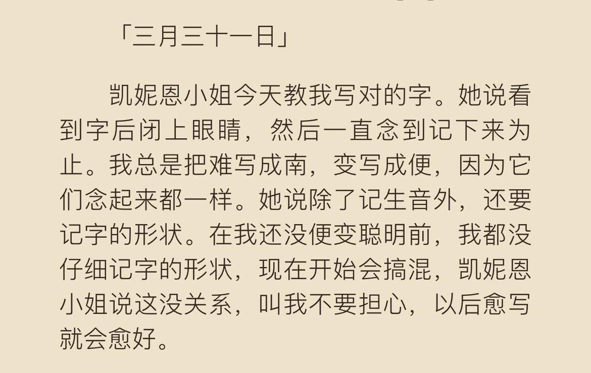

# Flowers for Algernon

> #33-34 | 2024年2月3日星期六 下午2:31:24
> 
> I tolld dr Strauss and perfesser Nemur I cant rite good but he says it dont matter he says I shud rite just like I talk and like I rite compushishens in Miss Kinnians class at the beekmin collidge center for retarted adults where I go to lern 3 times a week on my time off.

> #40-41 | 2024年2月3日星期六 下午2:34:14
> 
> He had a wite coat like a docter but I dont think he was no docter because he dint tell me to opin my mouth and say ah.

> #71-73 | 2024年2月3日星期六 下午2:42:11
> 
> He said you know Charlie we are not shure how this experamint will werk on pepul because we onley tried it up to now on animils. I said thats what Miss Kinnian tolld me but I dont even care if it herts or anything because Im strong and I will werk hard.

> #78-79 | 2024年2月3日星期六 下午2:44:18
> 
> Gimpy hollers at me all the time when I do something rong, but he reely likes me because hes my frend.

> #79 的笔记 | 添加于 2024年2月3日星期六 下午2:46:14
> 
> 第一次看到reely还以为是rarely,第二词意识到是really,再看到这里好心痛。。

> #149-150 | 2024年2月3日星期六 下午3:03:04
> 
> I said I dint care because I aint afraid of nothing. Im very strong and I always do good and beside I got my luky rabits foot and I never breakd a mirrir in my life. I droppd some dishis once but that dont count for bad luk.

> #157-158 | 2024年2月3日星期六 下午3:04:46
> 
> I dont no what sience is but they all keep saying it so mabye its something that helps you have good luk. Anyway

> #212-214 | 2024年2月3日星期六 下午3:18:47
> 
> She says she woud never let them do things to her branes for all the tea in china. I tolld her it wasnt for tea in china. It was to make me smart. And she said mabey they got no rite to make me smart because if god wantid me to be smart he would have made me born that way. And

> #225-227 | 2024年2月3日星期六 下午3:23:18
> 
> She said thats not the way it werks Charlie. It comes slowley and you have to werk very hard to get smart. I dint no that. If I got to werk hard anyway what did I have to have the operashun for.

> #242-242 | 2024年2月3日星期六 下午3:26:18
> 
> I still think those races and those tests are stoopid and I think riting these progress reports are stoopid to.

> #242 的笔记 | 添加于 2024年2月3日星期六 下午3:27:26
> 
> 变聪明的第一件事是觉得别人安排的工作没有意思,,

> #296-298 | 2024年2月3日星期六 下午3:42:32
> 
> This morning Gimpy hes the head baker and he has a bad foot and he limps he used my name when he shouted at Ernie because Ernie losst a birthday cake. He said Ernie for godsake you trying to be a Charlie Gordon. I dont know why he said that. I never lost any packiges.

> #298 的笔记 | 添加于 2024年2月3日星期六 下午3:45:00
> 
> 这是 我从没掉过整块儿面包啊! 的原文吗,原来语气是这样。。

> #373-376 | 2024年2月3日星期六 下午4:03:51
> 
> I dont remember how the party was over but they asked me to go around the corner to see if it was raining and when I came back there was no one their. Maybe they went to find me. I looked for them all over till it was late. But I got lost and I felt bad at myself for getting lost because I bet Algernon coud go up and down those streets a hundrid times and not get lost like I did.

> #384-385 | 2024年2月3日星期六 下午4:06:35
> 
> I must be getting smart to beat a smart mouse like Algernon. But I dont feel smarter.

> #387-388 | 2024年2月3日星期六 下午4:08:41
> 
> Burt said no Algernon is a very speshul mouse with an operashun like mine. He was the first of all the animals to stay smart so long and

> #388 的笔记 | 添加于 2024年2月3日星期六 下午4:10:45
> 
> 我才反应过来,动物实验做了一堆就成功了一个而且还没观察多久就在人身体上试验了啊

> #409-413 | 2024年2月3日星期六 下午4:29:27
> 
> March 31—Miss Kinnian teeches me how to spel better. She says look at a werd and close your eyes and say it over and over again until you remember. I have lots of truble with through that you say THREW and enough and tough that you dont say ENEW and TEW. You got to say ENUFF and TUFF. Thats how I use to rite it before I started to get smart. Im mixd up but Miss Kinnian says dont worry spelling is not suppose to make sence.

> #413 的笔记 | 添加于 2024年2月3日星期六 下午4:30:38
> 
> 搭配中文译文感受到翻译的奇妙了啊啊啊
>
> 

> #449-450 | 2024年2月3日星期六 下午5:23:10
> 
> She said for a person who God gave so little to you did more than a lot of people with brains they never even used.

> #463-463 | 2024年2月3日星期六 下午5:26:38
> 
> I dint know it then but I guess I know it now that she thought I was going to hurt the baby because I was too dumb to know what I was doing.

> #534-535 | 2024年2月3日星期六 下午6:17:41
> 
> I know now that the sign says DONNER'S BAKERY, but looking back in my memory at the sign I can't read the words through his eyes.

> #694-695 | 2024年2月4日星期日 下午4:20:48
> 
> I had reached a new level, and anger and suspicion were my first reactions to the world around me.
